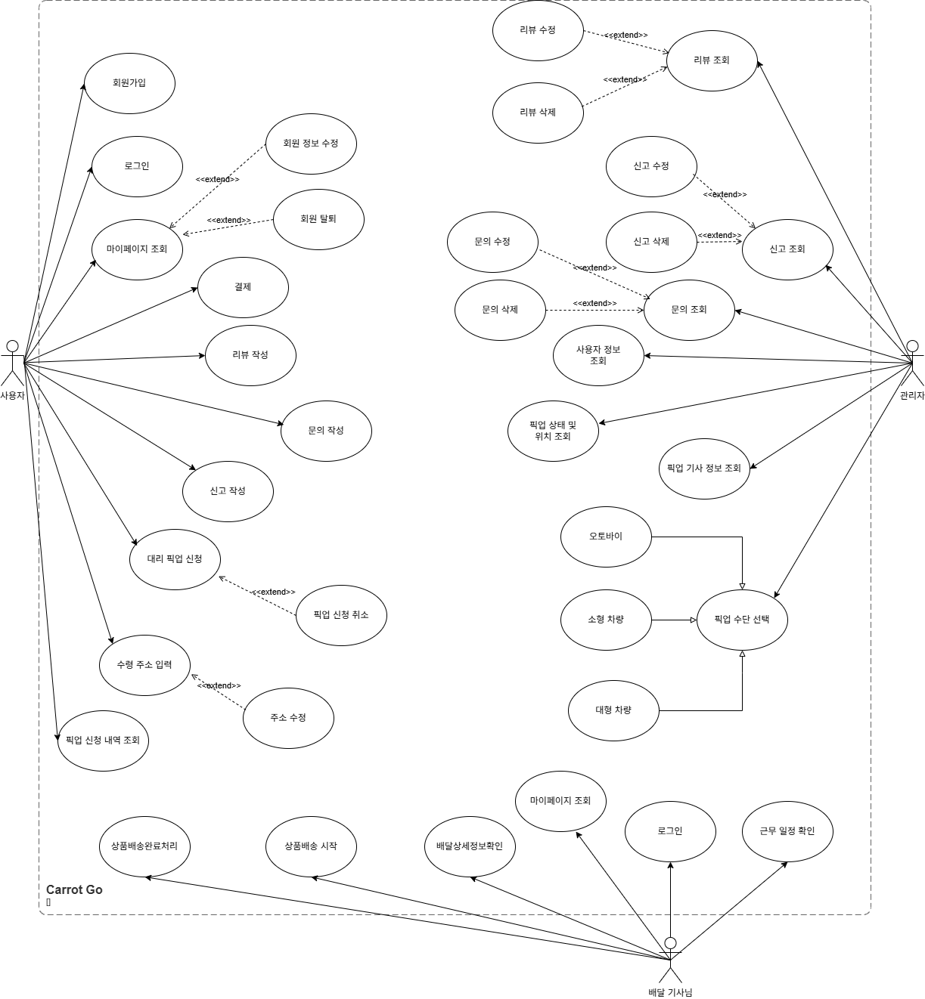
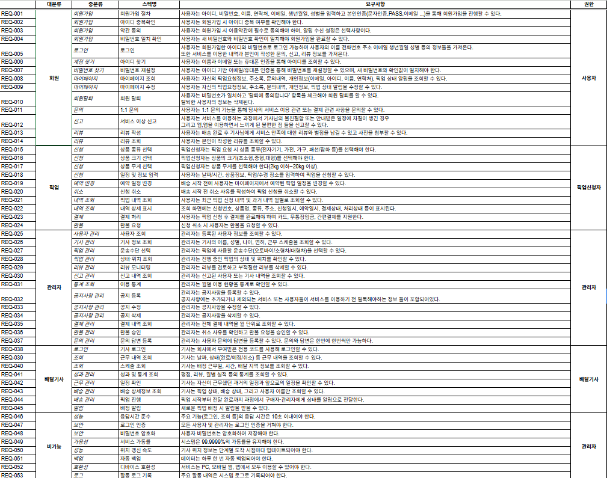
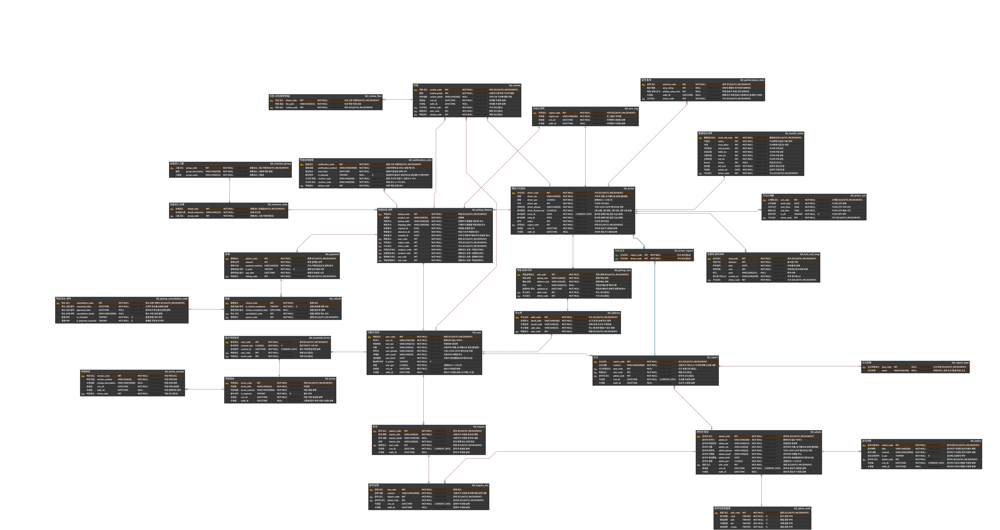
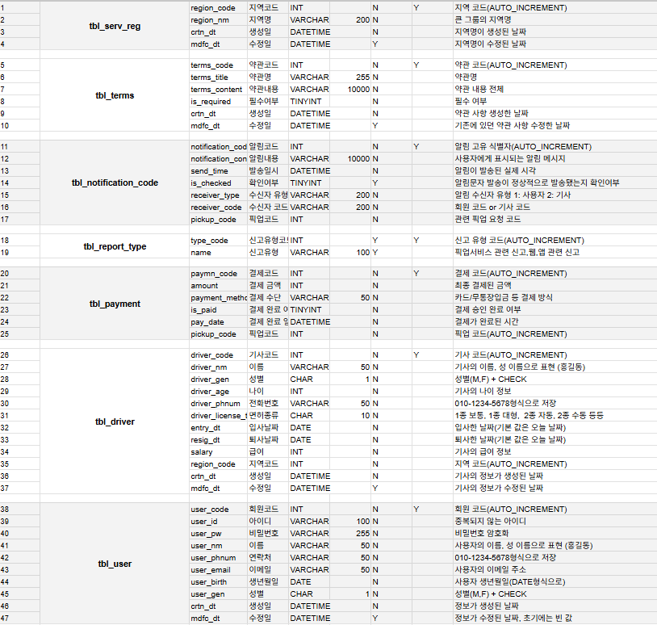
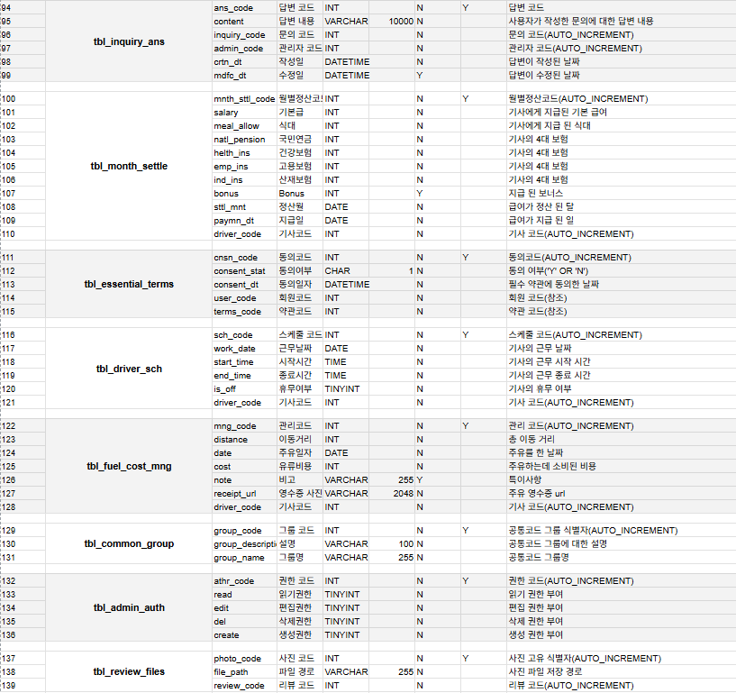

# 🚀 Carrot Go

<p align="center">
  
</p>


## 👤 팀원

<div align="center">

<table border="0" style="border: none; width: 80%;">
    <tr>
      <td align="center">
        
        <br />
        <b>윤성원</b>
        <br />
        <a href="https://github.com/qew032032">@qew032032</a>
      </td>
      <td align="center">
        
        <br />
        <b>박지민</b>
        <br />
        <a href="https://github.com/Jae-yeol1">@PPoTTO_Meow</a>
      </td>
      <td align="center">
        
        <br />
        <b>황자현</b>
        <br />
        <a href="https://github.com/Apeirogon99">@hwajh5229</a>
      </td>
      <td align="center">
        
        <br />
        <b>김태형</b>
        <br />
        <a href="https://github.com/ikt-kim">@ikth-kim</a>
      </td>
    </tr>
  </table>


</div>

## 📌 목차 (Table of Contents)

* [1. 프로젝트 개요](#1-프로젝트-개요)
* [2. 개발 환경 및 기술 스택](#2-개발-환경-및-기술-스택)
* [3. 프로젝트 구조](#3-프로젝트-구조)
* [4. 프로젝트 산출물](#4-프로젝트-산출물)
* [5. 테스트 케이스](#5-테스트-케이스)
* [6. 성능 향상 테스트케이스](#6-성능-향상-테스트케이스)
* [7. 프로젝트 회고](#7-프로젝트-회고)

---
## 1. 프로젝트 개요

프로젝트 캐럿 고("Carrot Go")는 기존 당근 앱의 개인 간 중고거래가 가진 거리, 시간적 한계를 극복하기 위해서 설계된 한심 대리 픽업 서비스입니다.
 

### 1-1. 핵심 목표
---
* 거래 편의성 극대화 : 거래 당사자가 직접 만나야 하는 부담감과 시간조율의 어려움을 해소합니다.
* 거래 안정성 확보 : 수령-보관-인계 과정의 투명한 이력 관리를 통해 중고거래의 낮은 신뢰도를 보완하고 안전한 거래 구축합니다.
* 전국 단위 확장 : 거리 제약 없이 장거리 중고 물품 거래를 가능하게 하여 시장을 확장합니다.

<br>

### 1-2. 기획 배경 및 필요성
---
현재 개인 간 중고거래는 다음과 같은 문제점을 안고 있어 잠재적인 거래 무산의 원인이 되고 있습니다.

| 문제점                   | 설명                                                                                             |
| :-------------------------- | :----------------------------------------------------------------------------------------------- |
| **직접 만남에 대한 부담** | 거래 당사자가 직접 대면해야 하는 심리적 부담감과 불편함이 존재합니다.       |
| **시간 및 일정 조율의 어려움** |서로의 일정이 맞지 않아 거래가 지연되거나 결국 무산되는 경우가 많습니다.     |
| **거리적 제약 및 불안정성** | 구매자가 원하는 매물이 멀리 있을 경우 직접 수령이 어렵고, 개인 간 택배 거래 시 거래 안정성 및 신뢰가 부족하여 구매를 망설이게 됩니다. |

<br>

### 1-3. 유사 서비스와의 차별점

<br>
<br>
당근마켓의 장점은 중고거래 시 발생할 수 있는 금액 문제를 안전계좌를 통해 안전하게 관리하고, 거래가 완료되면 확실히 금액을 수령할 수 있는 시스템에 있습니다. 그러나 당근마켓의 안전계좌 시스템을 사용하지 않을 경우, 비밀번호 사기 등 금전적 위험이 발생할 수 있습니다.
이에 비해 우리 서비스는 물품을 철저히 검증한 후 배송을 진행하기 때문에, 보다 신뢰할 수 있고 안정적인 중고거래 환경을 제공합니다.


---
* 🛡️ 안전 강화: 수령-보관-인계 전 과정에서 고객에게 제품 사진 전송 및 이력(상태 확인 절차) 제공.
* ✅ 공식 신뢰도: 공식적으로 보장된 플랫폼을 통해 낮은 신뢰도를 해결하고 보안성을 확보.
* 🗺️ 전국 서비스: 거리 구애받지 않고 전국 어디든 서비스가 가능하여 시장을 확장.

<br>

### 1-4. 기대 효과
---
| 핵심 효과                   | 설명                                                                                             |
| :-------------------------- | :----------------------------------------------------------------------------------------------- |
| **전국 단위 거래 가능** | 전국 어디서나 중고 물품을 구매하고 수령할 수 있게 되어 중고거래 시장의 지리적 한계를 극복합니다.       |
| **시간 효율성 증대** |거래자가 직접 물품을 수거·배송하는 시간을 절약할 수 있으며, 이를 통해 본인의 시간을 보다 효율적으로 활용할 수 있습니다.     |
| **신뢰 기반 거래 정착** | 제품 상태 이력 관리 및 플랫폼 인증 시스템을 통해 안전하고 신뢰할 수 있는 비대면 중고거래 환경을 제공합니다. |

<br>

### 1-5. 주요 기능
| 기능 영역                   | 주요 기능                                                                                             |
| :-------------------------- | :----------------------------------------------------------------------------------------------- |
| **통합 계정 및 인증** | 아이디/비밀번호 기반 회원가입, 본인인증, 아이디/비밀번호 찾기, 약관 동의.       |
| **원스톱 픽업 신청/결제** |상품 종류/크기/무게 선택, 장소/시간 입력, 카드/무통장입금/간편결제.     |
| **픽업 관리 및 변경** | 마이페이지에서 요청 정보/주소록/문의 내역 조회, 배송 전 예약 일정 변경 및 취소. |
| **거래 투명성/피드백** | 배송 진행 상황 추적 및 단계별 알림, 배송 완료 후 리뷰/별점/사진 작성 및 관리. |

<br>

## 2. 개발 환경 및 기술 스택

### 2-1. 개발 환경

- **DBMS**  


- **가상화 환경**  


- **협업 도구**  


- **버전 및 이슈 관리**  


- **데이터 관리**  


- **ERD 및 다이어그램 도구**  


<br>
<br>

---

## **3. 프로젝트 구조**
```
root/
│── .gitignore
│── README.md
|── DATA/
│   └── sample_data.sql
│── DDL/
│   └── create_table.sql
│── DML/
│   ├── admin/
│   ├── driver/
│   ├── pickup/  
│   └── user
│── DOCS/
│   └── images/      
│── TEST_QUERIES/           
│   ├── INDEX/               
│   ├── PROCEDURE/           
│   └── TRIGGER/           
```
<br>

---

## 4. 프로젝트 산출물

### 4-1. **UML**
<details><summary>유스케이스 다이어그램</summary>
  <p align="center"></img></p>
</details>
<br>

### 4-2. **요구사항명세서**
<details><summary>요구사항 명세서</summary>
  <p align="center"></img></p>
</details>
<br>

### 4-3. **WBS**
<details><summary>WBS</summary>
  <p align="center"></img></p>
</details>
<br>

### 4-4. **DB 모델링**
<details><summary>ERD</summary>
  <p align="center"></img></p>
</details>
<br>

### 4-5. **테이블 정의서**
<details><summary>테이블정의서</summary>
  <p align="center"></img></p>
  <p align="center"></img></p>
  <p align="center"></img></p>
  <p align="center"></img></p>
</details>
<br>

---

## 5. 테스트 케이스

### 5-1. 관리자
<details><summary>관리자 시나리오</summary>
  <p align="center"></img></p>
</details>
<br>

### 5-2. 회원
<details><summary>회원 시나리오</summary>
  <p align="center"></img></p>
</details>
<br>

### 5-3. 배달기사
<details><summary>배달기사 시나리오</summary>
  <p align="center"></img></p>
</details>
<br>

### 5-4. 픽업
<details><summary>픽업 시나리오</summary>
  <p align="center"></img></p>
</details>
<br>

---

## 6. 성능 향상 테스트케이스
<details><summary>INDEX</summary>
  <p align="center"></img></p>
</details>

<details><summary>PROCEDURE</summary>
  <p align="center"></img></p>
</details>

* "환불 처리(refund_code = 8) 시, SP_ProcessRefund 프로시저를 도입하여 환불 승인(tbl_refund)과 취소 내역 동기화(tbl_pickup_cancellation_code)를 하나의 트랜잭션으로 묶어 처리했습니다.
이를 통해 데이터 불일치 가능성을 원천 차단했으며, 애플리케이션과 데이터베이스 간의 통신 횟수를 줄여 관리자 페이지의 응답 속도와 안정성을 동시에 향상 시켰습니다.

* 프로시저 도입 전에는 1. 환불 기록 상태 업데이트 2. 관련 취소 코드 조회 3. 취소 내역 상태 동기화를 통해 3회의 통신을 해야하지만 프로시저 도입 후에는 이 3단계를 DB 내부에서 처리하여 통신 횟수를 1회로 줄였습니다.

<details><summary>TRIGGER</summary>
  <p align="center"></img></p>
</details>

* trg_after_inquiry_ans_insert 트리거 도입으로, 관리자가 답변을 등록할 때 DB와 주고받는 통신횟수가 절반 줄어든다.


## 7. 프로젝트 회고


