# 🚀 Carrot Go

<p align="center">
  
</p>


## 👤 팀원

<div align="center">

<table border="0" style="border: none; width: 80%;">
    <tr>
      <td align="center">
        
        <br />
        <b>윤성원</b>
        <br />
        <a href="https://github.com/qew032032">@qew032032</a>
      </td>
      <td align="center">
        
        <br />
        <b>박지민</b>
        <br />
        <a href="https://github.com/Jae-yeol1">@PPoTTO_Meow</a>
      </td>
      <td align="center">
        
        <br />
        <b>황자현</b>
        <br />
        <a href="https://github.com/Apeirogon99">@hwajh5229</a>
      </td>
      <td align="center">
        
        <br />
        <b>김태형</b>
        <br />
        <a href="https://github.com/ikt-kim">@ikth-kim</a>
      </td>
    </tr>
  </table>


</div>

## 📌 목차 (Table of Contents)

* [1. 프로젝트 개요](#1-프로젝트-개요)
* [2. 개발 환경 및 기술 스택](#2-개발-환경-및-기술-스택)
* [3. 프로젝트 구조](#3-프로젝트-구조)
* [4. 프로젝트 산출물](#4-프로젝트-산출물)
* [5. 테스트 케이스](#5-테스트-케이스)
* [6. 성능 향상 테스트케이스](#6-성능-향상-테스트케이스)
* [7. 프로젝트 회고](#7-프로젝트-회고)

---
## 1. 프로젝트 개요

프로젝트 캐럿 고("Carrot Go")는 기존 당근 앱의 개인 간 중고거래가 가진 거리, 시간적 한계를 극복하기 위해서 설계된 한심 대리 픽업 서비스입니다.
 

### 1-1. 핵심 목표
---
* 거래 편의성 극대화 : 거래 당사자가 직접 만나야 하는 부담감과 시간조율의 어려움을 해소합니다.
* 거래 안정성 확보 : 수령-보관-인계 과정의 투명한 이력 관리를 통해 중고거래의 낮은 신뢰도를 보완하고 안전한 거래 구축합니다.
* 전국 단위 확장 : 거리 제약 없이 장거리 중고 물품 거래를 가능하게 하여 시장을 확장합니다.

<br>

### 1-2. 기획 배경 및 필요성
---
현재 개인 간 중고거래는 다음과 같은 문제점을 안고 있어 잠재적인 거래 무산의 원인이 되고 있습니다.

| 문제점                   | 설명                                                                                             |
| :-------------------------- | :----------------------------------------------------------------------------------------------- |
| **직접 만남에 대한 부담** | 거래 당사자가 직접 대면해야 하는 심리적 부담감과 불편함이 존재합니다.       |
| **시간 및 일정 조율의 어려움** |서로의 일정이 맞지 않아 거래가 지연되거나 결국 무산되는 경우가 많습니다.     |
| **거리적 제약 및 불안정성** | 구매자가 원하는 매물이 멀리 있을 경우 직접 수령이 어렵고, 개인 간 택배 거래 시 거래 안정성 및 신뢰가 부족하여 구매를 망설이게 됩니다. |

<br>

### 1-3. 유사 서비스와의 차별점

<br>
<br>
당근마켓의 장점은 중고거래 시 발생할 수 있는 금액 문제를 안전계좌를 통해 안전하게 관리하고, 거래가 완료되면 확실히 금액을 수령할 수 있는 시스템에 있습니다. 그러나 당근마켓의 안전계좌 시스템을 사용하지 않을 경우, 비밀번호 사기 등 금전적 위험이 발생할 수 있습니다.
이에 비해 우리 서비스는 물품을 철저히 검증한 후 배송을 진행하기 때문에, 보다 신뢰할 수 있고 안정적인 중고거래 환경을 제공합니다.


---
* 🛡️ 안전 강화: 수령-보관-인계 전 과정에서 고객에게 제품 사진 전송 및 이력(상태 확인 절차) 제공.
* ✅ 공식 신뢰도: 공식적으로 보장된 플랫폼을 통해 낮은 신뢰도를 해결하고 보안성을 확보.
* 🗺️ 전국 서비스: 거리 구애받지 않고 전국 어디든 서비스가 가능하여 시장을 확장.

<br>

### 1-4. 기대 효과
---
| 핵심 효과                   | 설명                                                                                             |
| :-------------------------- | :----------------------------------------------------------------------------------------------- |
| **전국 단위 거래 가능** | 전국 어디서나 중고 물품을 구매하고 수령할 수 있게 되어 중고거래 시장의 지리적 한계를 극복합니다.       |
| **시간 효율성 증대** |거래자가 직접 물품을 수거·배송하는 시간을 절약할 수 있으며, 이를 통해 본인의 시간을 보다 효율적으로 활용할 수 있습니다.     |
| **신뢰 기반 거래 정착** | 제품 상태 이력 관리 및 플랫폼 인증 시스템을 통해 안전하고 신뢰할 수 있는 비대면 중고거래 환경을 제공합니다. |

<br>

### 1-5. 주요 기능
| 기능 영역                   | 주요 기능                                                                                             |
| :-------------------------- | :----------------------------------------------------------------------------------------------- |
| **통합 계정 및 인증** | 아이디/비밀번호 기반 회원가입, 본인인증, 아이디/비밀번호 찾기, 약관 동의.       |
| **원스톱 픽업 신청/결제** |상품 종류/크기/무게 선택, 장소/시간 입력, 카드/무통장입금/간편결제.     |
| **픽업 관리 및 변경** | 마이페이지에서 요청 정보/주소록/문의 내역 조회, 배송 전 예약 일정 변경 및 취소. |
| **거래 투명성/피드백** | 배송 진행 상황 추적 및 단계별 알림, 배송 완료 후 리뷰/별점/사진 작성 및 관리. |

<br>

## 2. 개발 환경 및 기술 스택

### 2-1. 개발 환경

- **DBMS**  


- **가상화 환경**  


- **협업 도구**  


- **버전 및 이슈 관리**  


- **데이터 관리**  


- **ERD 및 다이어그램 도구**  


<br>
<br>

---

## **3. 프로젝트 구조**
```
root/
│── .gitignore
│── README.md
|── DATA/
│   └── sample_data.sql
│── DDL/
│   └── create_table.sql
│── DML/
│   ├── admin/
│   ├── driver/
│   ├── pickup/  
│   └── user
│── DOCS/
│   └── images/      
└── TEST_QUERIES/           
    ├── INDEX/               
    ├── PROCEDURE/           
    └── TRIGGER/           
```
<br>

---

## 4. 프로젝트 산출물

### 4-1. **UML**
<details><summary>유스케이스 다이어그램</summary>
  <p align="center"></img></p>
</details>
<br>

### 4-2. **요구사항명세서**
<details><summary>요구사항 명세서</summary>
  <p align="center"></img></p>
</details>
<br>

### 4-3. **WBS**
<details><summary>WBS</summary>
  <p align="center">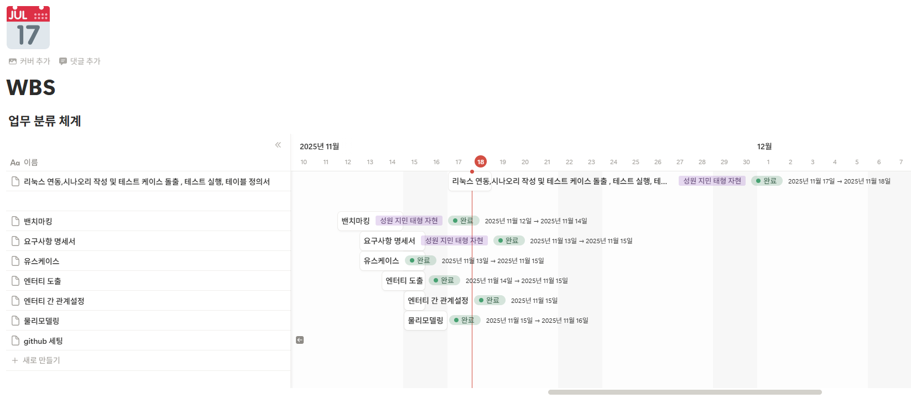</img></p>
</details>
<br>

### 4-4. **DB 모델링**
<details><summary>ERD</summary>
  <p align="center"></img></p>
</details>
<br>

### 4-5. **테이블 정의서**
<details><summary>테이블정의서</summary>
  <p align="center"></img></p>
  <p align="center">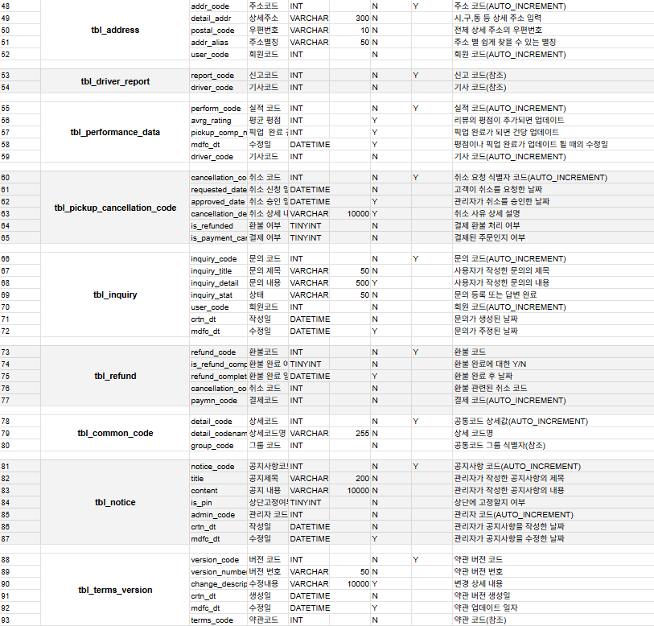</img></p>
  <p align="center"></img></p>
  <p align="center">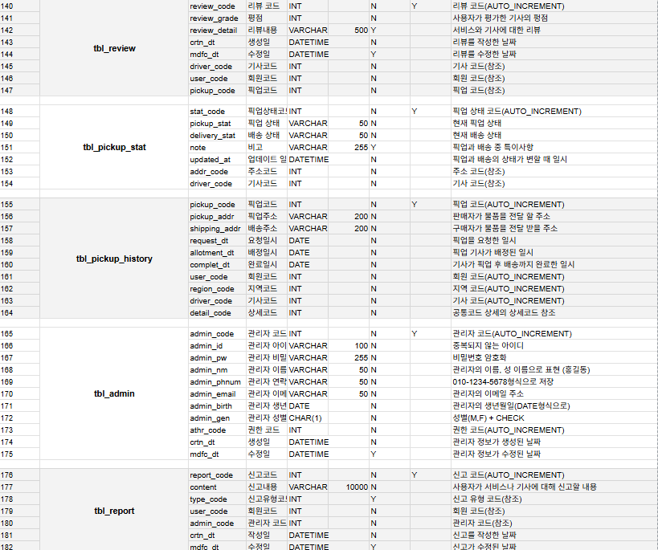</img></p>
</details>
<details><summary>CREATE TABLE</summary>

  ```SQL
    -- 1. 코어 마스터 테이블 (참조가 거의 없는 테이블)
  CREATE TABLE `tbl_user` (
    `user_code`	INT PRIMARY KEY AUTO_INCREMENT	NOT NULL	COMMENT '회원 코드',
    `user_id`	VARCHAR(100)	NOT NULL	COMMENT '중복되지 않는 아이디',
    `user_pw`	VARCHAR(255)	NOT NULL	COMMENT '비밀번호 암호화',
    `user_nm`	VARCHAR(50)	NOT NULL	COMMENT '사용자의 이름, 성 이름으로 표현 (홍길동)',
    `user_phnum`	VARCHAR(50)	NOT NULL	COMMENT '"010-1234-5678"형식으로 저장',
    `user_email`	VARCHAR(50)	NOT NULL	COMMENT '사용자의 이메일 주소',
    `user_birth`	DATE	NOT NULL	COMMENT '사용자 생년월일(DATE형식으로)',
    `user_gen`	CHAR(1)	NOT NULL	COMMENT '성별(M,F) + CHECK',
    `crtn_dt`	DATETIME	NOT NULL	COMMENT '정보가 생성된 날짜',
    `mdfc_dt`	DATETIME	NULL	COMMENT '정보가 수정된 날짜, 초기에는 빈 값'
  );

  CREATE TABLE `tbl_serv_reg` (
    `region_code`	INT AUTO_INCREMENT PRIMARY KEY NOT NULL	COMMENT '지역 코드',
    `region_nm`	VARCHAR(200)	NOT NULL	COMMENT '큰 그룹의 지역명',
    `crtn_dt`	DATETIME	NOT NULL	COMMENT '지역명이 생성된 날짜',
    `mdfc_dt`	DATETIME	NULL	COMMENT '지역명이 수정된 날짜'
  );

  CREATE TABLE `tbl_terms` (
    `terms_code`	INT PRIMARY KEY AUTO_INCREMENT NOT NULL	COMMENT '약관 코드',
    `terms_title`	VARCHAR(255)	NOT NULL	COMMENT '약관명',
    `terms_content`	VARCHAR(10000)	NOT NULL	COMMENT '약관 내용 전체',
    `is_required`	TINYINT	NOT NULL	DEFAULT 0	COMMENT '필수 여부',
    `crtn_dt`	DATETIME	NOT NULL	COMMENT '약관 사항 생성한 날짜',
    `mdfc_dt`	DATETIME	NULL	COMMENT '기존에 있던 약관 사항 수정한 날짜'
  );

  CREATE TABLE `tbl_report_type` (
    `type_code`	INT PRIMARY KEY AUTO_INCREMENT	NULL	COMMENT '신고 유형 코드',
    `name`	VARCHAR(100)	NULL	COMMENT '픽업서비스 관련 신고
  웹,앱 관련 신고'
  );

  CREATE TABLE `tbl_pickup_cancellation_code` (
    `cancellation_code`	INT PRIMARY KEY AUTO_INCREMENT	NOT NULL	COMMENT '취소 요청 식별자 코드',
    `requested_date`	DATETIME	NOT NULL	COMMENT '고객이 취소를 요청한 날짜',
    `approved_date`	DATETIME	NULL	COMMENT '관리자가 취소를 승인한 날짜',
    `cancellation_detail`	VARCHAR(10000)	NULL	COMMENT '취소 사유 상세 설명',
    `is_refunded`	TINYINT	NOT NULL	DEFAULT 0	COMMENT '결제 환불 처리 여부',
    `is_payment_canceled`	TINYINT	NOT NULL	DEFAULT 0	COMMENT '결제된 주문인지 여부'
  );

  CREATE TABLE `tbl_common_group` (
    `group_code`	INT	PRIMARY KEY AUTO_INCREMENT NOT NULL	COMMENT '공통코드 그룹 식별자',
    `group_description`	VARCHAR(100)	NOT NULL	COMMENT '공통코드 그룹에 대한 설명',
    `group_name`	VARCHAR(255)	NOT NULL	COMMENT '공통코드 그룹명'
  );

  CREATE TABLE `tbl_admin_auth` (
    `athr_code`	INT PRIMARY KEY AUTO_INCREMENT	NOT NULL	COMMENT '권한 코드',
    `read`	TINYINT	NOT NULL	DEFAULT 0	COMMENT '읽기 권한 부여',
    `edit`	TINYINT	NOT NULL	DEFAULT 0	COMMENT '편집 권한 부여',
    `del`	TINYINT	NOT NULL	DEFAULT 0	COMMENT '삭제 권한 부여',
    `create`	TINYINT	NOT NULL	DEFAULT 0	COMMENT '생성 권한 부여'
  );


  -- 2. 초기 참조 테이블 (레벨 1 의존성)
  CREATE TABLE `tbl_driver` (
    `driver_code`	INT PRIMARY KEY AUTO_INCREMENT	NOT NULL	COMMENT '기사 코드',
    `driver_nm`	VARCHAR(50)	NOT NULL	COMMENT '기사의 이름, 성 이름으로 표현 (홍길동)',
    `driver_gen`	CHAR(1)	NOT NULL	COMMENT '성별(M,F) + CHECK',
    `driver_age`	INT	NOT NULL	COMMENT '기사의 나이 정보',
    `driver_phnum`	VARCHAR(50)	NOT NULL	COMMENT '"010-1234-5678"형식으로 저장',
    `driver_license_typ`	CHAR(10)	NOT NULL	COMMENT '1종 보통, 1종 대형,  2종 자동, 2종 수동 등등',
    `entry_dt`	DATE	NOT NULL	DEFAULT CURRENT_DATE	COMMENT '입사한 날짜(기본 값은 오늘 날짜)',
    `resig_dt`	DATE	NULL	COMMENT '퇴사한 날짜(기본 값은 오늘 날짜)',
    `salary`	INT	NOT NULL	COMMENT '기사의 급여 정보',
    `region_code`	INT	NOT NULL	COMMENT '지역 코드(AUTO_INCREMENT)',
    `crtn_dt`	DATETIME	NOT NULL	COMMENT '기사의 정보가 생성된 날짜',
    `mdfc_dt`	DATETIME	NULL	COMMENT '기사의 정보가 수정된 날짜',
    FOREIGN KEY (region_code)
          REFERENCES tbl_serv_reg(region_code)
  );

  CREATE TABLE `tbl_admin` (
    `admin_code`	INT PRIMARY KEY AUTO_INCREMENT	NOT NULL	COMMENT '관리자 코드',
    `admin_id`	VARCHAR(100)	NOT NULL	COMMENT '중복되지 않는 아이디',
    `admin_pw`	VARCHAR(255)	NOT NULL	COMMENT '비밀번호 암호화',
    `admin_nm`	VARCHAR(50)	NOT NULL	COMMENT '관리자의 이름, 성 이름으로 표현 (홍길동)',
    `admin_phnum`	VARCHAR(50)	NOT NULL	COMMENT '"010-1234-5678"형식으로 저장',
    `admin_email`	VARCHAR(50)	NOT NULL	COMMENT '관리자의 이메일 주소',
    `admin_birth`	DATE	NOT NULL	COMMENT '관리자의 생년월일(DATE형식으로)',
    `admin_gen`	CHAR(1)	NOT NULL	COMMENT '성별(M,F) + CHECK',
    `athr_code`	INT	NOT NULL	COMMENT '권한 코드(참조)',
    `crtn_dt`	DATETIME	NOT NULL	DEFAULT CURRENT_DATE	COMMENT '관리자 정보가 생성된 날짜',
    `mdfc_dt`	DATETIME	NULL	COMMENT '관리자 정보가 수정된 날짜',
    FOREIGN KEY (athr_code)
          REFERENCES tbl_admin_auth(athr_code)
  );

  CREATE TABLE `tbl_address` (
    `addr_code`	INT PRIMARY KEY AUTO_INCREMENT	NOT NULL	COMMENT '주소 코드',
    `detail_addr`	VARCHAR(300)	NOT NULL	COMMENT '시,구,동 등 상세 주소 입력',
    `postal_code`	VARCHAR(10)	NOT NULL	COMMENT '전체 상세 주소의 우편번호',
    `addr_alias`	VARCHAR(50)	NOT NULL	COMMENT '주소 별 쉽게 찾을 수 있는 별칭',
    `user_code`	INT	NOT NULL	COMMENT '회원 코드(AUTO_INCREMENT)',
    FOREIGN KEY (user_code)
          REFERENCES tbl_user(user_code)
  );

  CREATE TABLE `tbl_inquiry` (
    `inquiry_code`	INT PRIMARY KEY AUTO_INCREMENT	NOT NULL	COMMENT '문의 코드',
    `inquiry_title`	VARCHAR(50)	NOT NULL	COMMENT '사용자가 작성한 문의의 제목',
    `inquiry_detail`	VARCHAR(500)	NULL	COMMENT '사용자가 작성한 문의의 내용',
    `inquiry_stat`	VARCHAR(50)	NOT NULL	COMMENT '문의 등록 또는 답변 완료',
    `user_code`	INT	NOT NULL	COMMENT '회원 코드(AUTO_INCREMENT)',
    `crtn_dt`	DATETIME	NOT NULL	DEFAULT CURRENT_DATE	COMMENT '문의가 생성된 날짜',
    `mdfc_dt`	DATETIME	NULL	COMMENT '문의가 주정된 날짜',
    FOREIGN KEY (user_code)
          REFERENCES tbl_user(user_code)
  );

  CREATE TABLE `tbl_common_code` (
    `detail_code`	INT PRIMARY KEY AUTO_INCREMENT	NOT NULL	COMMENT '공통코드 상세값',
    `detail_codename`	VARCHAR(255)	NOT NULL	COMMENT '상세 코드명',
    `group_code`	INT	NOT NULL	COMMENT '공통코드 그룹 식별자(참조)',
    FOREIGN KEY (group_code)
          REFERENCES tbl_common_group(group_code)
  );

  CREATE TABLE `tbl_terms_version` (
    `version_code`	INT PRIMARY KEY AUTO_INCREMENT	NOT NULL	COMMENT '약관 버전 코드',
    `version_number`	VARCHAR(50)	NOT NULL	COMMENT '약관 버전 번호',
    `change_description`	VARCHAR(10000)	NULL	COMMENT '변경 상세 내용',
    `crtn_dt`	DATETIME	NOT NULL	COMMENT '약관 버전 생성일',
    `mdfc_dt`	DATETIME	NULL	COMMENT '약관 업데이트 일자',
    `terms_code`	INT	NOT NULL	COMMENT '약관 코드(참조)',
    FOREIGN KEY (terms_code)
          REFERENCES tbl_terms(terms_code)
  );

  CREATE TABLE `tbl_essential_terms` (
    `cnsn_code`	INT PRIMARY KEY AUTO_INCREMENT	NOT NULL	COMMENT '동의코드',
    `consent_stat`	CHAR(1)	NOT NULL	DEFAULT 'Y'	COMMENT '동의 여부(\'Y\' OR \'N\')',
    `consent_dt`	DATETIME	NOT NULL	DEFAULT CURRENT_DATE	COMMENT '필수 약관에 동의한 날짜',
    `user_code`	INT	NOT NULL	COMMENT '회원 코드(참조)',
    `terms_code`	INT	NOT NULL	COMMENT '약관 코드(참조)',
    FOREIGN KEY (user_code)
          REFERENCES tbl_user(user_code),
    FOREIGN KEY (terms_code)
          REFERENCES tbl_terms(terms_code)
  );


  -- 3. 중간 참조 테이블 (레벨 2 의존성)
  CREATE TABLE `tbl_notice` (
    `notice_code`	INT PRIMARY KEY AUTO_INCREMENT	NOT NULL	COMMENT '공지사항 코드',
    `title`	VARCHAR(200)	NOT NULL	COMMENT '관리자가 작성한 공지사항의 제목',
    `content`	VARCHAR(10000)	NOT NULL	COMMENT '관리자가 작성한 공지사항의 내용',
    `is_pin`	TINYINT	NOT NULL	DEFAULT 0	COMMENT '상단에 고정할지 여부',
    `admin_code`	INT	NOT NULL	COMMENT '관리자 코드(AUTO_INCREMENT)',
    `crtn_dt`	DATETIME	NOT NULL	DEFAULT CURRENT_DATE	COMMENT '관리자가 공지사항을 작성한 날짜',
    `mdfc_dt`	DATETIME	NULL	COMMENT '관리자가 공지사항을 수정한 날짜',
    FOREIGN KEY (admin_code)
          REFERENCES tbl_admin(admin_code)
  );

  CREATE TABLE `tbl_performance_data` (
    `perform_code`	INT PRIMARY KEY	AUTO_INCREMENT NOT NULL	COMMENT '실적 코드',
    `avrg_rating`	INT	NULL	COMMENT '리뷰의 평점이 추가되면 업데이트',
    `pickup_comp_num`	INT	NULL	COMMENT '픽업 완료가 되면 건당 업데이트',
    `mdfc_dt`	DATETIME	NULL	COMMENT '평점이나 픽업 완료가 업데이트 될 때의 수정일',
    `driver_code`	INT	NOT NULL	COMMENT '기사 코드(AUTO_INCREMENT)',
    FOREIGN KEY (driver_code)
          REFERENCES tbl_driver(driver_code)
  );

  CREATE TABLE `tbl_month_settle` (
    `mnth_sttl_code`	INT PRIMARY KEY AUTO_INCREMENT	NOT NULL	COMMENT '월별정산코드',
    `salary`	INT	NOT NULL	COMMENT '기사에게 지급된 기본 급여',
    `meal_allow`	INT	NOT NULL	COMMENT '기사에게 지급 된 식대',
    `natl_pension`	INT	NOT NULL	COMMENT '기사의 4대 보험',
    `helth_ins`	INT	NOT NULL	COMMENT '기사의 4대 보험',
    `emp_ins`	INT	NOT NULL	COMMENT '기사의 4대 보험',
    `ind_ins`	INT	NOT NULL	COMMENT '기사의 4대 보험',
    `bonus`	INT	NULL	COMMENT '지급 된 보너스',
    `sttl_mnt`	DATE	NOT NULL	COMMENT '급여가 정산 된 달',
    `paymn_dt`	DATE	NOT NULL	COMMENT '급여가 지급 된 일',
    `driver_code`	INT	NOT NULL	COMMENT '기사 코드(참조)',
    FOREIGN KEY (driver_code)
          REFERENCES tbl_driver(driver_code)
  );

  CREATE TABLE `tbl_driver_sch` (
    `sch_code`	INT PRIMARY KEY AUTO_INCREMENT	NOT NULL	COMMENT '스케줄 코드',
    `work_date`	DATE	NOT NULL	COMMENT '기사의 근무 날짜',
    `start_time`	TIME	NOT NULL	COMMENT '기사의 근무 시작 시간',
    `end_time`	TIME	NOT NULL	COMMENT '기사의 근무 종료 시간',
    `is_off`	TINYINT	NOT NULL	DEFAULT 0	COMMENT '기사의 휴무 여부',
    `driver_code`	INT	NOT NULL	COMMENT '기사 코드(참조)',
    FOREIGN KEY (driver_code)
          REFERENCES tbl_driver(driver_code)
  );

  CREATE TABLE `tbl_fuel_cost_mng` (
    `mng_code`	INT PRIMARY KEY AUTO_INCREMENT	NOT NULL	COMMENT '관리 코드',
    `distance`	INT	NOT NULL	COMMENT '총 이동 거리',
    `date`	DATE	NOT NULL	COMMENT '주유를 한 날짜',
    `cost`	INT	NOT NULL	COMMENT '주유하는데 소비된 비용',
    `note`	VARCHAR(255)	NULL	COMMENT '특이사항',
    `receipt_url`	VARCHAR(2048)	NOT NULL	COMMENT '주유 영수증 url',
    `driver_code`	INT	NOT NULL	COMMENT '기사 코드(참조)',
    FOREIGN KEY (driver_code)
          REFERENCES tbl_driver(driver_code)
  );

  CREATE TABLE `tbl_pickup_stat` (
    `stat_code`	INT PRIMARY KEY AUTO_INCREMENT	NOT NULL	COMMENT '픽업 상태 코드',
    `pickup_stat`	VARCHAR(50)	NOT NULL	COMMENT '현재 픽업 상태',
    `delivery_stat`	VARCHAR(50)	NOT NULL	COMMENT '현재 배송 상태',
    `note`	VARCHAR(255)	NULL	COMMENT '픽업과 배송 중 특이사항',
    `updated_at`	DATETIME	NOT NULL	COMMENT '픽업과 배송의 상태가 변할 때 일시',
    `addr_code`	INT	NOT NULL	COMMENT '주소 코드(참조)',
    `driver_code`	INT	NOT NULL	COMMENT '기사 코드(참조)',
    FOREIGN KEY (addr_code)
          REFERENCES tbl_address(addr_code),
    FOREIGN KEY (driver_code)
          REFERENCES tbl_driver(driver_code)
  );

  CREATE TABLE `tbl_inquiry_ans` (
    `ans_code`	INT PRIMARY KEY AUTO_INCREMENT	NOT NULL	COMMENT '답변 코드',
    `content`	VARCHAR(10000)	NOT NULL	COMMENT '사용자가 작성한 문의에 대한 답변 내용',
    `inquiry_code`	INT	NOT NULL	COMMENT '문의 코드(참조)',
    `admin_code`	INT	NOT NULL	COMMENT '관리자 코드(참조)',
    `crtn_dt`	DATETIME	NOT NULL	DEFAULT CURRENT_DATE	COMMENT '답변이 작성된 날짜',
    `mdfc_dt`	DATETIME	NULL	COMMENT '답변이 수정된 날짜',
    FOREIGN KEY (inquiry_code)
          REFERENCES tbl_inquiry(inquiry_code),
    FOREIGN KEY (admin_code)
          REFERENCES tbl_admin(admin_code)
  );

  CREATE TABLE `tbl_report` (
    `report_code`	INT PRIMARY KEY AUTO_INCREMENT	NOT NULL	COMMENT '신고 코드',
    `content`	VARCHAR(10000)	NOT NULL	COMMENT '사용자가 서비스나 기사에 대해 신고할 내용',
    `type_code`	INT	NULL	COMMENT '신고 유형 코드(참조)',
    `user_code`	INT	NOT NULL	COMMENT '회원 코드(참조)',
    `admin_code`	INT	NOT NULL	COMMENT '관리자 코드(참조)',
    `crtn_dt`	DATETIME	NOT NULL	DEFAULT CURRENT_DATE	COMMENT '신고를 작성한 날짜',
    `mdfc_dt`	DATETIME	NULL	COMMENT '신고가 수정된 날짜',
    FOREIGN KEY (type_code)
          REFERENCES tbl_report_type(type_code),
    FOREIGN KEY (user_code)
          REFERENCES tbl_user(user_code),
    FOREIGN KEY (admin_code)
          REFERENCES tbl_admin(admin_code)
  );


  -- 4. 핵심 트랜잭션 및 최종 테이블 (레벨 3+ 의존성)
  CREATE TABLE `tbl_pickup_history` (
      `product_nm` VARCHAR(50) NOT NULL   COMMENT '물품의 이름',
    `pickup_code`	INT PRIMARY KEY AUTO_INCREMENT	NOT NULL	COMMENT '픽업 코드',
      `product_nm` VARCHAR(50) NOT NULL   COMMENT '물품의 이름',
    `pickup_addr`	VARCHAR(200)	NOT NULL	COMMENT '판매자가 물품을 전달 할 주소',
    `shipping_addr`	VARCHAR(200)	NOT NULL	COMMENT '구매자가 물품을 전달 받을 주소',
    `request_dt`	DATE	NOT NULL	COMMENT '픽업을 요청한 일시',
    `allotment_dt`	DATE	NULL	COMMENT '픽업 기사가 배정된 일시',
    `complet_dt`	DATE	NULL	COMMENT '기사가 픽업 후 배송까지 완료한 일시',
    `user_code`	INT	NOT NULL	COMMENT '회원 코드(참조)',
    `region_code`	INT	NOT NULL	COMMENT '지역 코드(참조)',
    `driver_code`	INT	NOT NULL	COMMENT '기사 코드(참조)',
    `category_code`	INT	NOT NULL	COMMENT '공통코드 상세 - 카테고리코드',
      `product_code` INT NOT NULL     COMMENT '공통코드 상세 - 상품정보코드',
      `pay_code` INT NOT NULL     COMMENT '공통코드 상세 - 결제방식코드',
      `stat_code` INT NOT NULL    COMMENT '공통코드 상세 - 픽업상태코드',
    FOREIGN KEY (user_code)
          REFERENCES tbl_user(user_code),
    FOREIGN KEY (region_code)
          REFERENCES tbl_serv_reg(region_code),
    FOREIGN KEY (driver_code)
          REFERENCES tbl_driver(driver_code),
    FOREIGN KEY (category_code)
          REFERENCES tbl_common_code(detail_code),
      FOREIGN KEY (product_code)
          REFERENCES tbl_common_code(detail_code),
      FOREIGN KEY (pay_code)
          REFERENCES tbl_common_code(detail_code),
      FOREIGN KEY (stat_code)
          REFERENCES tbl_common_code(detail_code)

  );

  /*
  alter table tbl_pickup_history add column product_nm varchar(50);
  */

  CREATE TABLE `tbl_driver_report` (
    `report_code`	INT	NOT NULL	COMMENT '신고 코드(참조)',
    `driver_code`	INT	NOT NULL	COMMENT '기사 코드(참조)',
    FOREIGN KEY (report_code)
          REFERENCES tbl_report(report_code),
    FOREIGN KEY (driver_code)
          REFERENCES tbl_driver(driver_code)
  );

  CREATE TABLE `tbl_notification_code` (
    `notification_code`	INT PRIMARY KEY AUTO_INCREMENT	NOT NULL	COMMENT '알림 고유 식별자',
    `notification_content`	VARCHAR(10000)	NOT NULL	COMMENT '사용자에게 표시되는 알림 메시지',
    `send_time`	DATETIME	NOT NULL	COMMENT '알림이 발송된 실제 시각',
    `is_checked`	TINYINT	NULL	DEFAULT 0	COMMENT '알림문자 발송이 정상적으로 발송됐는지 확인여부',
    `receiver_type`	VARCHAR(200)	NOT NULL	COMMENT '알림 수신자 유형 1: 사용자 2: 기사',
    `receiver_code`	VARCHAR(200)	NOT NULL	COMMENT '회원 코드 or 기사 코드',
    `pickup_code`	INT	NOT NULL	COMMENT '관련 픽업 요청 코드',
    FOREIGN KEY (pickup_code)
          REFERENCES tbl_pickup_history(pickup_code)
  );

  CREATE TABLE `tbl_payment` (
    `paymn_code`	INT PRIMARY KEY AUTO_INCREMENT	NOT NULL	COMMENT '결제 코드',
    `amount`	INT	NOT NULL	COMMENT '최종 결제된 금액',
    `payment_method`	VARCHAR(50)	NOT NULL	COMMENT '카드/무통장입금 등 결제 방식',
    `is_paid`	TINYINT	NOT NULL	DEFAULT 0	COMMENT '결제 승인 완료 여부',
    `pay_date`	DATETIME	NOT NULL	COMMENT '결제가 완료된 시간',
    `pickup_code`	INT	NOT NULL	COMMENT '픽업 코드(AUTO_INCREMENT)',
    FOREIGN KEY (pickup_code)
          REFERENCES tbl_pickup_history(pickup_code)
  );

  CREATE TABLE `tbl_review` (
    `review_code`	INT PRIMARY KEY AUTO_INCREMENT	NOT NULL	COMMENT '리뷰 코드',
    `review_grade`	INT	NOT NULL	COMMENT '사용자가 평가한 기사의 펑점',
    `review_detail`	VARCHAR(500)	NULL	COMMENT '서비스와 기사에 대한 리뷰',
    `crtn_dt`	DATETIME	NOT NULL	COMMENT '리뷰를 작성한 날짜',
    `mdfc_dt`	DATETIME	NULL	COMMENT '리뷰를 수정한 날짜',
    `driver_code`	INT	NOT NULL	COMMENT '기사 코드(참조)',
    `user_code`	INT	NOT NULL	COMMENT '회원 코드(참조)',
    `pickup_code`	INT	NOT NULL	COMMENT '픽업 코드(참조)',
    FOREIGN KEY (driver_code)
          REFERENCES tbl_driver(driver_code),
    FOREIGN KEY (user_code)
          REFERENCES tbl_user(user_code),
    FOREIGN KEY (pickup_code)
          REFERENCES tbl_pickup_history(pickup_code)
  );

  CREATE TABLE `tbl_refund` (
    `refund_code`	INT PRIMARY KEY AUTO_INCREMENT NOT NULL	COMMENT '환불 코드',
    `is_refund_completed`	TINYINT	NOT NULL	DEFAULT 0	COMMENT '환불 완료에 대한 Y/N',
    `refund_completed_date`	DATETIME	NULL	COMMENT '환불 완료 후 날짜',
    `cancellation_code`	INT	NOT NULL	COMMENT '환불 관련된 취소 코드',
    `paymn_code`	INT	NOT NULL	COMMENT '결제 코드(참조)',
    FOREIGN KEY (cancellation_code)
          REFERENCES tbl_pickup_cancellation_code(cancellation_code),
    FOREIGN KEY (paymn_code)
          REFERENCES tbl_payment(paymn_code)
  );

  CREATE TABLE `tbl_review_files` (
    `photo_code`	INT PRIMARY KEY AUTO_INCREMENT	NOT NULL	COMMENT '사진 고유 식별자',
    `file_path`	VARCHAR(255)	NOT NULL	COMMENT '사진 파일 저장 경로',
    `review_code`	INT	NOT NULL	COMMENT '리뷰 코드(참조)',
    FOREIGN KEY (review_code)
          REFERENCES tbl_review(review_code)
  );


  ```
</details>
<details><summary>INSERT</summary>

```SQL
INSERT INTO `tbl_user` (`user_id`, `user_pw`, `user_nm`, `user_phnum`, `user_email`, `user_birth`, `user_gen`, `crtn_dt`, `mdfc_dt`) VALUES
('user001', 'hashed_pw_001', '김철수', '010-1111-2222', 'kimcs@example.com', '1990-05-15', 'M', NOW(), NULL),
('user002', 'hashed_pw_002', '이영희', '010-3333-4444', 'leeyh@example.com', '1995-11-20', 'F', NOW(), NULL),
('user003', 'hashed_pw_003', '박민수', '010-5555-6666', 'parkms@example.com', '1988-01-01', 'M', NOW(), NULL),
('user004', 'hashed_pw_004', '정은지', '010-7777-8888', 'jungej@example.com', '2000-07-25', 'F', NOW(), NULL),
('user005', 'hashed_pw_005', '최현우', '010-9999-0000', 'choihw@example.com', '1985-03-10', 'M', NOW(), NULL),
('user006', 'hashed_pw_006', '강수진', '010-1234-5678', 'kangsi@example.com', '1992-09-12', 'F', NOW(), NULL),
('user007', 'hashed_pw_007', '윤도현', '010-2345-6789', 'yundh@example.com', '1975-04-22', 'M', NOW(), NULL),
('user008', 'hashed_pw_008', '한지민', '010-3456-7890', 'hanjm@example.com', '1998-12-05', 'F', NOW(), NULL),
('user009', 'hashed_pw_009', '신동엽', '010-4567-8901', 'shindy@example.com', '1980-06-30', 'M', NOW(), NULL),
('user010', 'hashed_pw_010', '오나라', '010-5678-9012', 'onara@example.com', '1993-10-18', 'F', NOW(), NULL),
('user011', 'hashed_pw_011', '김나라', '010-5679-8912', 'kimnara@example.com', '1999-10-18', 'F', NOW(), NULL),
('user012', 'hashed_pw_012', '박나라', '010-8759-4568', 'parknara@example.com', '1999-12-24', 'F', NOW(), NULL);


INSERT INTO `tbl_serv_reg` (`region_nm`, `crtn_dt`, `mdfc_dt`) VALUES
('서울 강남구', NOW(), NULL),
('서울 마포구', NOW(), NULL),
('경기 성남시', NOW(), NULL),
('인천 연수구', NOW(), NULL),
('부산 해운대구', NOW(), NULL),
('대구 수성구', NOW(), NULL),
('대전 유성구', NOW(), NULL),
('광주 서구', NOW(), NULL),
('울산 남구', NOW(), NULL),
('세종시 전체', NOW(), NULL);


INSERT INTO `tbl_terms` (`terms_title`, `terms_content`, `is_required`, `crtn_dt`, `mdfc_dt`) VALUES
('서비스 이용약관', '서비스 이용에 관한 필수적인 약관 내용입니다.', 1, NOW(), NULL),
('개인정보 수집 및 이용 동의', '개인정보 수집에 대한 필수 동의 내용입니다.', 1, NOW(), NULL),
('위치기반 서비스 이용약관', '위치정보 이용에 대한 선택적 동의 내용입니다.', 0, NOW(), NULL),
('마케팅 정보 수신 동의', '이벤트 및 프로모션 정보 수신에 대한 선택적 동의 내용입니다.', 0, NOW(), NULL),
('환불 정책', '서비스 이용료 환불에 대한 안내 내용입니다.', 1, NOW(), NULL),
('차량 이용 수칙', '픽업 차량 이용 시 준수 사항입니다.', 1, NOW(), NULL),
('제3자 정보 제공 동의', '서비스 제공을 위한 제3자 정보 제공 동의 내용입니다.', 0, NOW(), NULL),
('청소년 보호 정책', '청소년 보호를 위한 정책 및 가이드라인입니다.', 1, NOW(), NULL),
('계정 복구 약관', '계정 분실 시 복구 절차에 대한 약관입니다.', 1, NOW(), NULL),
('운영 정책 및 가이드라인', '서비스 운영 전반에 대한 상세 정책입니다.', 1, NOW(), NULL);


INSERT INTO `tbl_report_type` (`name`) VALUES
('기사 불친절/태도 문제'),
('기사 운전 미숙/난폭 운전'),
('픽업 지연/약속 불이행'),
('서비스 품질 불만'),
('웹/앱 오류 발생'),
('결제 및 환불 관련 문의'),
('개인정보 유출 의심'),
('불법 광고/스팸 신고'),
('기타 서비스 관련 문의'),
('물품 파손/분실');


INSERT INTO `tbl_pickup_cancellation_code` (`requested_date`, `approved_date`, `cancellation_detail`, `is_refunded`, `is_payment_canceled`) VALUES
(DATE_SUB(NOW(), INTERVAL 5 DAY), DATE_SUB(NOW(), INTERVAL 4 DAY), '개인 사정으로 인한 픽업 취소', 1, 1),
(DATE_SUB(NOW(), INTERVAL 3 DAY), DATE_SUB(NOW(), INTERVAL 2 DAY), '시간 착오로 인한 요청', 1, 1),
(DATE_SUB(NOW(), INTERVAL 1 DAY), NULL, '기사 배정 지연으로 인한 취소 요청', 0, 0),
(DATE_SUB(NOW(), INTERVAL 10 HOUR), DATE_SUB(NOW(), INTERVAL 8 HOUR), '주소 오기입으로 인한 취소', 1, 1),
(DATE_SUB(NOW(), INTERVAL 2 DAY), DATE_SUB(NOW(), INTERVAL 1 DAY), '물품 준비 미완료', 1, 1),
(DATE_SUB(NOW(), INTERVAL 1 WEEK), DATE_SUB(NOW(), INTERVAL 6 DAY), '고객 요청으로 인한 긴급 취소', 1, 1),
(DATE_SUB(NOW(), INTERVAL 12 HOUR), NULL, '기사-고객 간 소통 오류', 0, 0),
(DATE_SUB(NOW(), INTERVAL 5 HOUR), DATE_SUB(NOW(), INTERVAL 4 HOUR), '다른 운송 수단 이용 결정', 1, 1),
(DATE_SUB(NOW(), INTERVAL 3 WEEK), DATE_SUB(NOW(), INTERVAL 2 WEEK), '날짜 변경 필요', 1, 1),
(DATE_SUB(NOW(), INTERVAL 7 HOUR), NULL, '결제 오류로 인한 취소 후 재요청', 0, 0);

INSERT INTO `tbl_common_group` (`group_description`, `group_name`) VALUES
('픽업 요청 시 물품의 종류를 분류합니다.', '물품 카테고리'),
('픽업 요청 시 물품의 크기를 분류합니다.', '물품 무게 및 크기'),
('픽업 서비스 상태를 구분합니다.', '서비스 상태'),
('결제 수단을 분류합니다.', '결제 수단');

INSERT INTO `tbl_common_code` (`detail_codename`, `group_code`) VALUES
('의류/잡화', 1), -- 물품 카테고리
('가전/디지털', 1), -- 물품 카테고리
('도서/문구', 1), -- 물품 카테고리
('초소형(2~20kg 이하)', 2), -- 물품 무게 및 크기
('소형(20kg~40kg 이하)', 2), -- 물품 무게 및 크기
('중형(40kg~60kg 이하)', 2), -- 물품 무게 및 크기
('대형(60~100kg)', 2), -- 물품 무게
('요청 접수', 3), -- 서비스 상태
('픽업 진행 중', 3), -- 서비스 상태
('배송 완료', 3), -- 서비스 상태
('카드 결제', 4), -- 결제 수단
('무통장 입금', 4), -- 결제 수단
('카카오페이', 4), -- 결제 수단
('네이버페이', 4); -- 결제 수단


INSERT INTO `tbl_admin_auth` (`read`, `edit`, `del`, `create`) VALUES
(1, 0, 0, 0), -- 뷰어(읽기 전용)
(1, 1, 0, 0), -- 일반 운영팀(읽기, 편집)
(1, 1, 1, 1), -- 슈퍼 관리자(모든 권한)
(1, 0, 0, 1), -- 콘텐츠 생성자(읽기, 생성)
(0, 0, 1, 0), -- 삭제 전용
(1, 1, 0, 1), -- 개발/기술팀
(1, 1, 1, 0), -- 데이터 관리팀
(0, 0, 0, 0), -- 비활성 계정
(1, 0, 1, 0), -- 감사팀(읽기, 삭제)
(1, 1, 1, 1); -- 시스템 관리자(최고 권한)


INSERT INTO `tbl_driver` (`driver_nm`, `driver_gen`, `driver_age`, `driver_phnum`, `driver_license_typ`, `entry_dt`, `salary`, `region_code`, `crtn_dt`, `mdfc_dt`) VALUES
('홍길동', 'M', 35, '010-1000-1000', '1종 보통', '2020-03-01', 40000000, 1, NOW(), NULL),
('김민지', 'F', 28, '010-2000-2000', '2종 자동', '2021-08-15', 38000000, 2, NOW(), NULL),
('박서준', 'M', 42, '010-3000-3000', '1종 대형', '2019-01-20', 45000000, 3, NOW(), NULL),
('이하늘', 'F', 31, '010-4000-4000', '2종 자동', '2022-05-10', 39000000, 4, NOW(), NULL),
('최강민', 'M', 50, '010-5000-5000', '1종 보통', '2018-11-25', 48000000, 5, NOW(), NULL),
('정유미', 'F', 26, '010-6000-6000', '2종 자동', '2023-02-01', 37000000, 6, NOW(), NULL),
('강호동', 'M', 45, '010-7000-7000', '1종 대형', '2017-06-12', 46000000, 7, NOW(), NULL),
('윤아름', 'F', 33, '010-8000-8000', '2종 자동', '2020-10-01', 41000000, 8, NOW(), NULL),
('신동우', 'M', 38, '010-9000-9000', '1종 보통', '2021-04-05', 42000000, 9, NOW(), NULL),
('오영주', 'F', 29, '010-0000-0000', '2종 자동', '2023-11-01', 36000000, 10, NOW(), NULL);


INSERT INTO `tbl_admin` (`admin_id`, `admin_pw`, `admin_nm`, `admin_phnum`, `admin_email`, `admin_birth`, `admin_gen`, `athr_code`, `crtn_dt`, `mdfc_dt`) VALUES
('admin_root', 'admin_hash_01', '이재석', '010-1111-1111', 'root@carrotgo.com', '1980-01-01', 'M', 3, NOW(), NULL), -- 슈퍼 관리자
('op_manager', 'admin_hash_02', '최지수', '010-2222-2222', 'op@carrotgo.com', '1992-05-15', 'F', 2, NOW(), NULL), -- 일반 운영팀
('data_analyst', 'admin_hash_03', '김태형', '010-3333-3333', 'data@carrotgo.com', '1985-11-20', 'M', 7, NOW(), NULL), -- 데이터 관리팀
('content_writer', 'admin_hash_04', '박은영', '010-4444-4444', 'content@carrotgo.com', '1998-03-10', 'F', 4, NOW(), NULL), -- 콘텐츠 생성자
('viewer_01', 'admin_hash_05', '정준호', '010-5555-5555', 'view1@carrotgo.com', '1975-07-25', 'M', 1, NOW(), NULL), -- 뷰어
('dev_team', 'admin_hash_06', '한승연', '010-6666-6666', 'dev@carrotgo.com', '1993-09-12', 'F', 6, NOW(), NULL), -- 개발/기술팀
('auditor_01', 'admin_hash_07', '신민철', '010-7777-7777', 'audit@carrotgo.com', '1982-04-22', 'M', 9, NOW(), NULL), -- 감사팀
('op_staff_01', 'admin_hash_08', '배수지', '010-8888-8888', 'op_stf1@carrotgo.com', '1996-12-05', 'F', 2, NOW(), NULL), -- 일반 운영팀
('system_manager', 'admin_hash_09', '윤성현', '010-9999-9999', 'sys@carrotgo.com', '1988-06-30', 'M', 10, NOW(), NULL), -- 시스템 관리자
('inactive_acc', 'admin_hash_10', '황보라', '010-0000-0000', 'inactive@carrotgo.com', '1990-10-18', 'F', 8, NOW(), NULL); -- 비활성 계정


INSERT INTO `tbl_address` (`detail_addr`, `postal_code`, `addr_alias`, `user_code`) VALUES
('서울 강남구 테헤란로 123, 101호', '06130', '회사 주소', 1),
('서울 마포구 월드컵로 250, 502호', '03900', '집 주소', 2),
('경기 성남시 분당구 판교역로 10', '13494', '본가 주소', 3),
('인천 연수구 송도과학로 30', '21984', '대학교 기숙사', 4),
('부산 해운대구 센텀시티로 78, 201동 101호', '48058', '부산 별장', 5),
('대구 수성구 동대구로 99, 105동 503호', '42126', '친척 집', 6),
('대전 유성구 대덕대로 1200', '34141', '대전 거주지', 7),
('광주 서구 상무대로 500, 3층', '61947', '사무실 주소', 8),
('울산 남구 삼산로 10, 707호', '44604', '친구 집', 9),
('세종특별자치시 한누리대로 100, 202호', '30151', '세종 아파트', 10);


INSERT INTO `tbl_inquiry` (`inquiry_title`, `inquiry_detail`, `inquiry_stat`, `user_code`, `crtn_dt`, `mdfc_dt`) VALUES
('픽업 서비스 시간 변경 문의', '다음 주 화요일 픽업 시간을 2시간 늦추고 싶습니다.', '답변 완료', 1, DATE_SUB(NOW(), INTERVAL 7 DAY), DATE_SUB(NOW(), INTERVAL 6 DAY)),
('기사님 불친절 신고', '기사님이 물건을 던지듯 놓았습니다. 확인 부탁드립니다.', '문의 등록', 2, DATE_SUB(NOW(), INTERVAL 5 DAY), NULL),
('결제 수단 변경 오류', '결제 수단을 바꾸려는데 계속 오류가 발생합니다.', '답변 완료', 3, DATE_SUB(NOW(), INTERVAL 4 DAY), DATE_SUB(NOW(), INTERVAL 3 DAY)),
('배송 지역 확대 요청', '현재 살고 있는 지역으로도 서비스를 확대해주세요.', '문의 등록', 4, DATE_SUB(NOW(), INTERVAL 2 DAY), NULL),
('회원 탈퇴 방법 문의', '계정을 비활성화하고 싶은데 방법을 알려주세요.', '답변 완료', 5, DATE_SUB(NOW(), INTERVAL 1 DAY), NOW()),
('파손 물품 보상 절차', '배송 중 물품이 파손되었습니다. 보상 절차를 알고 싶습니다.', '문의 등록', 6, NOW(), NULL),
('공지사항 확인 불가', '앱 내 공지사항 페이지가 로딩되지 않습니다.', '문의 등록', 7, NOW(), NULL),
('새로운 주소 등록 문제', '신규 주소를 등록하려는데 우편번호 검색이 안됩니다.', '문의 등록', 8, NOW(), NULL),
('서비스 이용료 문의', '픽업 서비스 이용료 책정 기준이 궁금합니다.', '답변 완료', 9, DATE_SUB(NOW(), INTERVAL 10 DAY), DATE_SUB(NOW(), INTERVAL 8 DAY)),
('장기 보관 서비스 요청', '물품을 1주일 정도 보관 후 배송하고 싶습니다.', '문의 등록', 10, NOW(), NULL);


INSERT INTO `tbl_terms_version` (`version_number`, `change_description`, `crtn_dt`, `mdfc_dt`, `terms_code`) VALUES
('V1.0', '최초 서비스 이용약관 등록', '2020-01-01', NULL, 1), -- 서비스 이용약관
('V1.1', '개인정보 보호법 개정에 따른 내용 수정', '2022-03-15', NULL, 2), -- 개인정보 수집
('V1.0', '최초 위치기반 서비스 약관 등록', '2021-05-20', NULL, 3), -- 위치기반 서비스
('V2.0', '마케팅 정보 수신 범위 확대', '2023-01-01', NULL, 4), -- 마케팅 동의
('V1.2', '환불 수수료 정책 변경', '2023-11-01', NULL, 5), -- 환불 정책
('V1.0', '최초 차량 이용 수칙 등록', '2020-07-01', NULL, 6), -- 차량 이용 수칙
('V1.0', '최초 제3자 정보 제공 동의 약관 등록', '2022-09-01', NULL, 7), -- 제3자 정보 제공
('V1.0', '최초 청소년 보호 정책 등록', '2021-04-10', NULL, 8), -- 청소년 보호 정책
('V1.0', '최초 계정 복구 약관 등록', '2022-12-01', NULL, 9), -- 계정 복구 약관
('V2.1', '운영 정책 관련 고객 대응 절차 세분화', '2024-01-20', NULL, 10); -- 운영 정책


INSERT INTO `tbl_essential_terms` (`consent_stat`, `consent_dt`, `user_code`, `terms_code`) VALUES
('Y', NOW(), 1, 1), -- user 1, 서비스 이용약관 (필수)
('Y', NOW(), 1, 2), -- user 1, 개인정보 수집 (필수)
('Y', NOW(), 2, 1), -- user 2, 서비스 이용약관 (필수)
('Y', NOW(), 2, 2), -- user 2, 개인정보 수집 (필수)
('N', NOW(), 3, 3), -- user 3, 위치기반 서비스 (선택 - 동의 안 함)
('Y', NOW(), 4, 5), -- user 4, 환불 정책 (필수)
('Y', NOW(), 5, 6), -- user 5, 차량 이용 수칙 (필수)
('N', NOW(), 6, 4), -- user 6, 마케팅 동의 (선택 - 동의 안 함)
('Y', NOW(), 7, 8), -- user 7, 청소년 보호 정책 (필수)
('Y', NOW(), 8, 9); -- user 8, 계정 복구 약관 (필수)


INSERT INTO `tbl_notice` (`title`, `content`, `is_pin`, `admin_code`, `crtn_dt`, `mdfc_dt`) VALUES
('서비스 약관 개정 안내 (2025년 1월 1일 시행)', '서비스 이용약관이 개정되어 주요 변경 사항을 안내드립니다.', 1, 3, NOW(), NULL),
('추석 연휴 픽업/배송 일정 안내', '추석 연휴 기간에는 픽업 및 배송 일정이 조정되오니 참고 바랍니다.', 1, 2, DATE_SUB(NOW(), INTERVAL 1 MONTH), NULL),
('개인정보처리방침 변경 고지', '더 나은 서비스 제공을 위해 개인정보처리방침이 일부 변경됩니다.', 0, 1, DATE_SUB(NOW(), INTERVAL 2 WEEK), NULL),
('앱 업데이트 (V2.1.0) 주요 변경사항', '앱 기능 개선 및 버그 수정 사항을 확인해주세요.', 0, 6, DATE_SUB(NOW(), INTERVAL 5 DAY), NULL),
('기사 안전 교육 의무화 안내', '모든 기사님은 분기별 안전 교육을 이수해야 합니다.', 1, 9, NOW(), NULL),
('Carrot Go 신규 지역 서비스 오픈 (부산)', '부산 해운대구 지역에서 서비스를 시작합니다.', 0, 2, DATE_SUB(NOW(), INTERVAL 3 WEEK), NULL),
('시스템 점검으로 인한 서비스 일시 중단 안내', '안정적인 서비스 제공을 위해 새벽 시간 점검을 실시합니다.', 0, 6, DATE_SUB(NOW(), INTERVAL 2 DAY), NULL),
('겨울철 운행 주의사항 공지', '빙판길 및 폭설에 대비하여 안전 운전을 부탁드립니다.', 0, 1, DATE_SUB(NOW(), INTERVAL 4 MONTH), NULL),
('고객센터 운영 시간 변경 안내', '평일 고객센터 운영 시간이 1시간 단축됩니다.', 0, 2, NOW(), NULL),
('자주 묻는 질문(FAQ) 업데이트', '자주 묻는 질문 10개가 추가되었습니다.', 0, 3, DATE_SUB(NOW(), INTERVAL 1 WEEK), NULL);


INSERT INTO `tbl_performance_data` (`avrg_rating`, `pickup_comp_num`, `mdfc_dt`, `driver_code`) VALUES
(4, 150, NOW(), 1), -- 홍길동
(5, 80, NOW(), 2), -- 김민지
(4, 220, NOW(), 3), -- 박서준
(4, 95, NOW(), 4), -- 이하늘
(5, 300, NOW(), 5), -- 최강민
(3, 50, NOW(), 6), -- 정유미
(5, 180, NOW(), 7), -- 강호동
(4, 110, NOW(), 8), -- 윤아름
(4, 160, NOW(), 9), -- 신동우
(5, 75, NOW(), 10); -- 오영주


INSERT INTO `tbl_month_settle` (`salary`, `meal_allow`, `natl_pension`, `helth_ins`, `emp_ins`, `ind_ins`, `bonus`, `sttl_mnt`, `paymn_dt`, `driver_code`) VALUES
(4000000, 300000, 180000, 120000, 50000, 10000, 500000, '2025-10-01', '2025-10-25', 1),
(3800000, 300000, 170000, 110000, 45000, 9000, 300000, '2025-10-01', '2025-10-25', 2),
(4500000, 300000, 200000, 130000, 55000, 12000, 800000, '2025-10-01', '2025-10-25', 3),
(3900000, 300000, 175000, 115000, 48000, 9500, NULL, '2025-10-01', '2025-10-25', 4),
(4800000, 300000, 210000, 140000, 60000, 13000, 1000000, '2025-10-01', '2025-10-25', 5),
(3700000, 300000, 165000, 105000, 42000, 8500, NULL, '2025-10-01', '2025-10-25', 6),
(4600000, 300000, 205000, 135000, 57000, 12500, 900000, '2025-10-01', '2025-10-25', 7),
(4100000, 300000, 185000, 125000, 52000, 10500, 400000, '2025-10-01', '2025-10-25', 8),
(4200000, 300000, 190000, 128000, 53000, 10800, 600000, '2025-10-01', '2025-10-25', 9),
(3600000, 300000, 160000, 100000, 40000, 8000, NULL, '2025-10-01', '2025-10-25', 10);


INSERT INTO `tbl_driver_sch` (`work_date`, `start_time`, `end_time`, `is_off`, `driver_code`) VALUES
('2025-11-17', '09:00:00', '18:00:00', 0, 1),
('2025-11-17', '10:00:00', '19:00:00', 0, 2),
('2025-11-17', '12:00:00', '21:00:00', 0, 3),
('2025-11-18', '08:00:00', '17:00:00', 0, 4),
('2025-11-18', '09:00:00', '18:00:00', 0, 5),
('2025-11-18', '00:00:00', '00:00:00', 1, 6), -- 휴무
('2025-11-19', '11:00:00', '20:00:00', 0, 7),
('2025-11-19', '09:00:00', '18:00:00', 0, 8),
('2025-11-19', '00:00:00', '00:00:00', 1, 9), -- 휴무
('2025-11-20', '13:00:00', '22:00:00', 0, 10);


INSERT INTO `tbl_fuel_cost_mng` (`distance`, `date`, `cost`, `note`, `receipt_url`, `driver_code`) VALUES
(250, '2025-11-10', 55000, '고속도로 주행 많음', 'http://receipt.url/d1_f1', 1),
(180, '2025-11-12', 40000, NULL, 'http://receipt.url/d2_f2', 2),
(300, '2025-11-08', 65000, '경유차량', 'http://receipt.url/d3_f3', 3),
(150, '2025-11-15', 35000, '시내 주행 위주', 'http://receipt.url/d4_f4', 4),
(350, '2025-11-05', 70000, '장거리 운행', 'http://receipt.url/d5_f5', 5),
(100, '2025-11-13', 25000, '주유량 적음', 'http://receipt.url/d6_f6', 6),
(280, '2025-11-09', 60000, NULL, 'http://receipt.url/d7_f7', 7),
(190, '2025-11-14', 42000, '주말 주유', 'http://receipt.url/d8_f8', 8),
(210, '2025-11-07', 48000, NULL, 'http://receipt.url/d9_f9', 9),
(130, '2025-11-11', 32000, '출퇴근용', 'http://receipt.url/d10_f10', 10);


INSERT INTO `tbl_pickup_stat` (`pickup_stat`, `delivery_stat`, `note`, `updated_at`, `addr_code`, `driver_code`) VALUES
('픽업 완료', '배송 중', '물품 상태 양호', NOW(), 1, 1),
('픽업 대기', '배송 대기', NULL, DATE_SUB(NOW(), INTERVAL 1 HOUR), 2, 2),
('픽업 중', '배송 전', '교통 체증으로 10분 지연', DATE_SUB(NOW(), INTERVAL 30 MINUTE), 3, 3),
('픽업 완료', '배송 완료', '수령인 부재로 경비실 보관', DATE_SUB(NOW(), INTERVAL 2 DAY), 4, 4),
('픽업 완료', '배송 중', NULL, DATE_SUB(NOW(), INTERVAL 5 HOUR), 5, 5),
('픽업 실패', '배송 전', '고객 취소 요청', DATE_SUB(NOW(), INTERVAL 1 DAY), 6, 6),
('픽업 대기', '배송 대기', '판매자 연락 두절', DATE_SUB(NOW(), INTERVAL 2 HOUR), 7, 7),
('픽업 중', '배송 전', NULL, NOW(), 8, 8),
('픽업 완료', '배송 완료', '직접 전달 완료', DATE_SUB(NOW(), INTERVAL 3 DAY), 9, 9),
('픽업 대기', '배송 대기', '내일 픽업 예정', DATE_SUB(NOW(), INTERVAL 10 HOUR), 10, 10);


INSERT INTO `tbl_inquiry_ans` (`content`, `inquiry_code`, `admin_code`, `crtn_dt`, `mdfc_dt`) VALUES
('요청하신 픽업 시간 변경 처리 완료되었습니다.', 1, 2, DATE_SUB(NOW(), INTERVAL 6 DAY), NULL),
('기사님 불친절 신고 접수되었으며, 내부적으로 조치 후 피드백 드리겠습니다.', 2, 8, NOW(), NULL),
('결제 수단 변경 오류는 시스템 재부팅 후 해결되었습니다. 다시 시도해 주세요.', 3, 6, DATE_SUB(NOW(), INTERVAL 3 DAY), NULL),
('배송 지역 확대는 현재 검토 중에 있으며, 확정 시 공지하겠습니다.', 4, 2, NOW(), NULL),
('회원 탈퇴는 마이페이지 > 설정에서 진행하실 수 있습니다.', 5, 2, DATE_SUB(NOW(), INTERVAL 1 DAY), NULL),
('파손 물품 보상 절차는 [링크]에서 확인하실 수 있으며, 담당 부서로 연결해드리겠습니다.', 6, 8, NOW(), NULL),
('공지사항 로딩 오류는 일시적인 현상으로 현재는 정상화되었습니다.', 7, 6, NOW(), NULL),
('신규 주소 등록 시 우편번호 검색 시스템을 확인하고 있습니다. 불편을 드려 죄송합니다.', 8, 3, NOW(), NULL),
('서비스 이용료는 거리에 따라 차등 적용되며, 상세 기준은 공지사항을 참고해 주세요.', 9, 2, DATE_SUB(NOW(), INTERVAL 8 DAY), NULL),
('장기 보관 서비스는 현재 제공하고 있지 않습니다. 양해 부탁드립니다.', 10, 8, NOW(), NULL);


INSERT INTO `tbl_report` (`content`, `type_code`, `user_code`, `admin_code`, `crtn_dt`, `mdfc_dt`) VALUES
('픽업 기사님이 통화 중 반말을 사용했습니다. 불쾌했습니다.', 1, 2, 2, DATE_SUB(NOW(), INTERVAL 5 DAY), NULL),
('운행 중 급정거를 너무 많이 하여 불안했습니다.', 2, 4, 7, DATE_SUB(NOW(), INTERVAL 3 DAY), NULL),
('픽업 예정 시간보다 30분 늦게 도착했습니다. 사전 연락도 없었습니다.', 3, 1, 8, DATE_SUB(NOW(), INTERVAL 1 DAY), NULL),
('배송된 물품의 포장이 뜯겨져 있었습니다.', 10, 6, 2, NOW(), NULL),
('앱을 실행하면 갑자기 종료되는 현상이 반복됩니다.', 5, 3, 6, NOW(), NULL),
('제 개인정보가 유출되었다는 스팸 문자를 받았습니다.', 7, 5, 3, DATE_SUB(NOW(), INTERVAL 2 WEEK), NULL),
('Carrot Go를 사칭하는 불법 광고를 발견했습니다.', 8, 7, 7, DATE_SUB(NOW(), INTERVAL 4 DAY), NULL),
('결제 금액이 청구서와 다르게 나왔습니다. 확인 부탁드립니다.', 6, 8, 8, NOW(), NULL),
('서비스 이용에 대한 전반적인 불만 사항입니다. 담당자 연락 바랍니다.', 4, 9, 2, DATE_SUB(NOW(), INTERVAL 1 WEEK), NULL),
('기타: 차량 내부가 청결하지 않았습니다.', 9, 10, 7, NOW(), NULL);


select * from tbl_pickup_history;
INSERT INTO `tbl_pickup_history` (`product_nm`,`pickup_addr`, `shipping_addr`, `request_dt`, `allotment_dt`, `complet_dt`, `user_code`, `region_code`, `driver_code`, `category_code`, `product_code`, `pay_code`, `stat_code`) VALUES
('노스페이스 패딩','서울 강남구 역삼동 101호', '경기 성남시 분당구 정자동 502호', CURDATE() - INTERVAL 5 DAY, null, null, 1, 1, 1, 1, 4,11, 8), -- 의류/잡화
('galaxy book pro','인천 연수구 송도동 203호', '부산 해운대구 우동 101동', CURDATE() - INTERVAL 4 DAY, CURDATE() - INTERVAL 3 DAY, CURDATE() - INTERVAL 2 DAY, 2, 4, 5, 2, 5,12, 9), -- 가전/디지털
('한강이 온다','대구 수성구 만촌동 305호', '대전 유성구 봉명동 404호', CURDATE() - INTERVAL 3 DAY, CURDATE() - INTERVAL 2 DAY, CURDATE() - INTERVAL 1 DAY, 3, 6, 7, 3, 6,13, 10), -- 도서/문구
('나이키 조던','광주 서구 치평동 507호', '울산 남구 달동 608호', CURDATE() - INTERVAL 2 DAY, CURDATE() - INTERVAL 1 DAY, CURDATE(), 4, 8, 9, 1, 7,14, 8), -- 의류/잡화
('브리츠 cd플레이어 (블투연결가능)','서울 마포구 서교동 709호', '세종특별자치시 한솔동 810호', CURDATE() - INTERVAL 1 DAY, CURDATE() - INTERVAL 12 HOUR, CURDATE() - INTERVAL 6 HOUR, 5, 2, 2, 2, 4, 11,9), -- 가전/디지털
('해커스토익 기출보카','경기 성남시 야탑동 111호', '서울 강남구 논현동 222호', CURDATE() - INTERVAL 10 DAY, CURDATE() - INTERVAL 9 DAY, CURDATE() - INTERVAL 8 DAY, 6, 3, 3, 3,5,12,10), -- 도서/문구
('와이케이 스타 로고 리버시블 코듀로이 숏패딩','부산 기장군 일광면 333호', '인천 미추홀구 주안동 444호', CURDATE() - INTERVAL 7 DAY, NULL, NULL, 7, 5, 4, 1,6,13, 8), -- 의류/잡화
('닌텐도 스위치 2','대전 서구 둔산동 555호', '대구 동구 신암동 666호', CURDATE() - INTERVAL 6 DAY, CURDATE() - INTERVAL 5 DAY, CURDATE() - INTERVAL 4 DAY, 8, 7, 6, 2,7,11,9), -- 가전/디지털
('최태성의 한국사','울산 북구 호계동 777호', '광주 광산구 수완동 888호', CURDATE() - INTERVAL 5 DAY, CURDATE() - INTERVAL 4 DAY, CURDATE() - INTERVAL 3 DAY, 9, 9, 8, 3,4,12, 10), -- 도서/문구
('아식스x슈슈통 콜라보 스니커즈','세종시 고운동 999호', '서울 영등포구 여의도동 000호', CURDATE() - INTERVAL 4 DAY, CURDATE() - INTERVAL 3 DAY, CURDATE() - INTERVAL 2 DAY, 10, 10, 10, 1,5,13,11),
('나이키 알파플라이3','인천시 연수구 연수동 185호', '서울 서초구 서초동 125호', '2025-04-13', '2025-04-12', '2025-04-14', 12, 10, 10, 1,5,13,8),
('나이키 AIR JORDAN Ⅴ 270mm','서울시 종로구 명륜동 212호', '서울 서초구 서초동 125호', CURDATE() - INTERVAL 4 DAY, CURDATE() - INTERVAL 3 DAY, CURDATE() - INTERVAL 2 DAY, 12, 10, 10, 1,5,13,8),
('나이키 우먼스 브이투케이 런 블랙 앤 메탈릭실버','인천시 남동구 구월동 185호', '서울 서초구 서초동 125호', '2024-09-12', '2024-09-11', '2024-09-13', 12, 10, 10, 1,5,13,8);


INSERT INTO `tbl_driver_report` (`report_code`, `driver_code`) VALUES
(1, 1), -- 신고 1 (기사 불친절) -> 기사 1
(2, 3), -- 신고 2 (운전 미숙) -> 기사 3
(3, 10), -- 신고 3 (픽업 지연) -> 기사 10
(4, 5), -- 신고 4 (물품 파손) -> 기사 5
(9, 2), -- 신고 9 (서비스 불만) -> 기사 2
(1, 4), -- 신고 1 (기사 불친절) -> 기사 4
(2, 6), -- 신고 2 (운전 미숙) -> 기사 6
(3, 8), -- 신고 3 (픽업 지연) -> 기사 8
(4, 7), -- 신고 4 (물품 파손) -> 기사 7
(9, 9); -- 신고 9 (서비스 불만) -> 기사 9


INSERT INTO `tbl_notification_code` (`notification_content`, `send_time`, `is_checked`, `receiver_type`, `receiver_code`, `pickup_code`) VALUES
('픽업 요청이 성공적으로 접수되었습니다.', NOW() - INTERVAL 5 DAY, 1, 'USER', '1', 1),
('기사님 배정이 완료되었습니다. (담당: 김민지 기사님)', NOW() - INTERVAL 4 DAY, 1, 'USER', '2', 2),
('픽업 기사가 곧 도착합니다.', NOW() - INTERVAL 3 DAY, 0, 'DRIVER', '7', 3),
('픽업이 완료되었습니다. 배송을 시작합니다.', NOW() - INTERVAL 2 DAY, 1, 'USER', '4', 4),
('배송이 완료되었습니다. 확인해 주세요.', NOW() - INTERVAL 1 DAY, 1, 'USER', '5', 5),
('픽업 요청이 취소되었습니다. 상세 내용은 고객센터 문의 바랍니다.', NOW() - INTERVAL 10 DAY, 1, 'USER', '6', 6),
('오늘의 운행 스케줄을 확인해 주세요.', NOW() - INTERVAL 7 DAY, 1, 'DRIVER', '4', 7),
('배송 지역 변경이 필요합니다.', NOW() - INTERVAL 6 DAY, 0, 'DRIVER', '6', 8),
('결제가 성공적으로 승인되었습니다.', NOW() - INTERVAL 5 DAY, 1, 'USER', '9', 9),
('리뷰를 작성하고 포인트를 받아가세요!', NOW() - INTERVAL 4 DAY, 0, 'USER', '10', 10);


INSERT INTO `tbl_payment` (`amount`, `payment_method`, `is_paid`, `pay_date`, `pickup_code`) VALUES
(12000, '카드 결제', 1, NOW() - INTERVAL 3 DAY, 1),
(18500, '무통장 입금', 1, NOW() - INTERVAL 2 DAY, 2),
(15000, '카카오페이', 1, NOW() - INTERVAL 1 DAY, 3),
(9900, '네이버페이', 1, NOW(), 4),
(21000, '카드 결제', 1, NOW() - INTERVAL 10 HOUR, 5),
(13500, '무통장 입금', 0, NOW() - INTERVAL 5 DAY, 6), -- 결제 미완료 (또는 취소된 주문)
(10000, '카드 결제', 1, NOW() - INTERVAL 7 DAY, 7),
(17000, '카카오페이 5', 1, NOW() - INTERVAL 6 DAY, 8),
(25000, '네이버페이', 1, NOW() - INTERVAL 4 DAY, 9),
(11000, '카드 결제', 1, NOW() - INTERVAL 3 DAY, 10);


INSERT INTO `tbl_review` (`review_grade`, `review_detail`, `crtn_dt`, `mdfc_dt`, `driver_code`, `user_code`, `pickup_code`) VALUES
(5, '매우 친절하고 신속하게 픽업해주셨습니다.', NOW() - INTERVAL 2 DAY, NULL, 1, 1, 1),
(4, '물품을 안전하게 전달받았습니다. 감사합니다.', NOW() - INTERVAL 1 DAY, NULL, 5, 2, 2),
(5, '정확한 시간에 도착하셨고, 안내도 친절했습니다.', NOW() - INTERVAL 12 HOUR, NULL, 7, 3, 3),
(3, '픽업 시간이 15분 정도 지연되어 아쉬웠습니다.', NOW() - INTERVAL 5 HOUR, NULL, 9, 4, 4),
(5, '완벽한 서비스입니다. 기사님 최고!', NOW() - INTERVAL 20 HOUR, NULL, 2, 5, 5),
(1, '기사님이 운전 중 통화를 너무 오래 하셨습니다.', NOW() - INTERVAL 8 DAY, NULL, 3, 6, 6),
(5, '새벽 픽업이었는데도 빠르고 정확했습니다.', NOW() - INTERVAL 5 DAY, NULL, 4, 7, 7),
(4, '물품 포장이 조금 훼손되었지만, 배송은 빨랐습니다.', NOW() - INTERVAL 3 DAY, NULL, 6, 8, 8),
(5, '다음에 또 이용할 의사 있습니다. 만족합니다.', NOW() - INTERVAL 2 DAY, NULL, 8, 9, 9),
(4, '배송 상태는 좋았으나, 기사님이 급하게 가시는 듯했습니다.', NOW() - INTERVAL 1 DAY, NULL, 10, 10, 10);

INSERT INTO `tbl_review_files` (`file_path`, `review_code`) VALUES
('http://files.carrotgo.com/review/1/photo_1.jpg', 1),
('http://files.carrotgo.com/review/2/photo_a.png', 2),
('http://files.carrotgo.com/review/3/photo_b.jpg', 3),
('http://files.carrotgo.com/review/4/photo_c.jpeg', 4),
('http://files.carrotgo.com/review/5/photo_d.jpg', 5),
('http://files.carrotgo.com/review/6/photo_e.png', 6),
('http://files.carrotgo.com/review/7/photo_f.jpg', 7),
('http://files.carrotgo.com/review/8/photo_g.jpg', 8),
('http://files.carrotgo.com/review/8/photo_h.jpg', 8), -- 리뷰 8은 사진 2장
('http://files.carrotgo.com/review/9/photo_i.jpg', 9);


INSERT INTO `tbl_refund` (`is_refund_completed`, `refund_completed_date`, `cancellation_code`, `paymn_code`) VALUES
(1, NOW() - INTERVAL 3 DAY, 1, 1), -- 취소 1, 결제 1에 대한 환불 완료
(1, NOW() - INTERVAL 2 DAY, 2, 2), -- 취소 2, 결제 2에 대한 환불 완료
(0, NULL, 3, 3), -- 취소 3 (아직 승인 전) -> 결제 3
(1, NOW(), 4, 4), -- 취소 4, 결제 4에 대한 환불 완료
(1, NOW() - INTERVAL 1 DAY, 5, 5), -- 취소 5, 결제 5에 대한 환불 완료
(1, NOW() - INTERVAL 6 DAY, 6, 7), -- 취소 6, 결제 7에 대한 환불 완료
(0, NULL, 7, 8), -- 취소 7 (아직 승인 전) -> 결제 8
(1, NOW() - INTERVAL 4 DAY, 8, 9), -- 취소 8, 결제 9에 대한 환불 완료
(1, NOW() - INTERVAL 10 DAY, 9, 10), -- 취소 9, 결제 10에 대한 환불 완료
(0, NULL, 10, 6); -- 취소 10 (아직 승인 전) -> 결제 6 (이 결제는 미완료였으므로 환불 처리 자체가 대기일 수 있음)

```

</details>

<br>

  


---

## 5. 테스트 케이스

### 5-1. 관리자
<details><summary>조건에 맞는 사용자 조회</summary>
  <p align="center"></img></p>
</details>
<details><summary>기사 상세 정보 조회 및 스케줄 조회/특정 조건으로 기사 급여 조회</summary>
  <p align="center"></img></p>
</details>
<details><summary>현재 '픽업 대기' 중인 건들의 상태 조회</summary>
  <p align="center">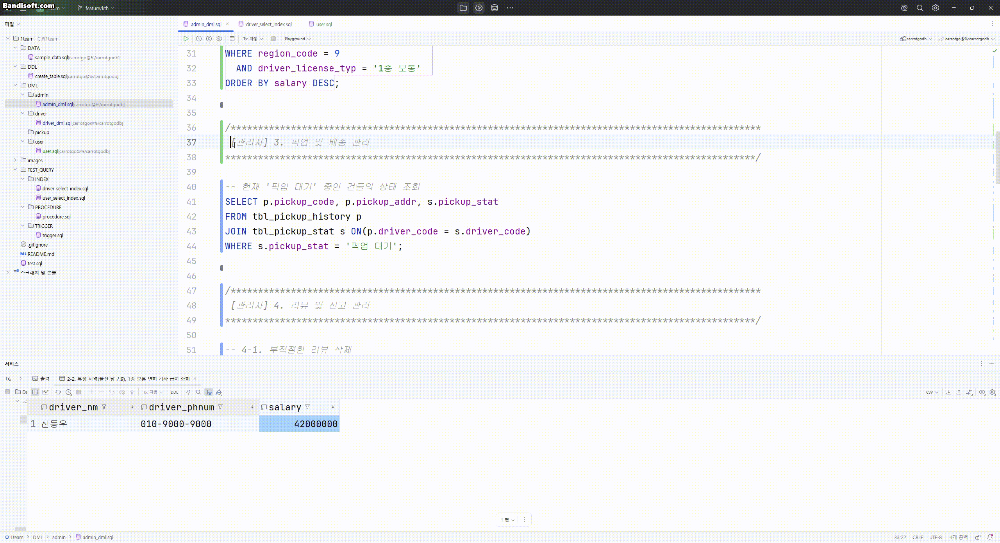</img></p>
</details>
<details><summary>부적절한 리뷰 삭제/신고 내역 조회</summary>
  <p align="center"></img></p>
</details>
<details><summary>공지사항 등록/수정/삭제</summary>
  <p align="center"></img></p>
</details>
<details><summary>결제 내역 조회/환불 요청 승인 처리</summary>
  <p align="center"></img></p>
</details>
<details><summary>문의 답변 등록</summary>
  <p align="center">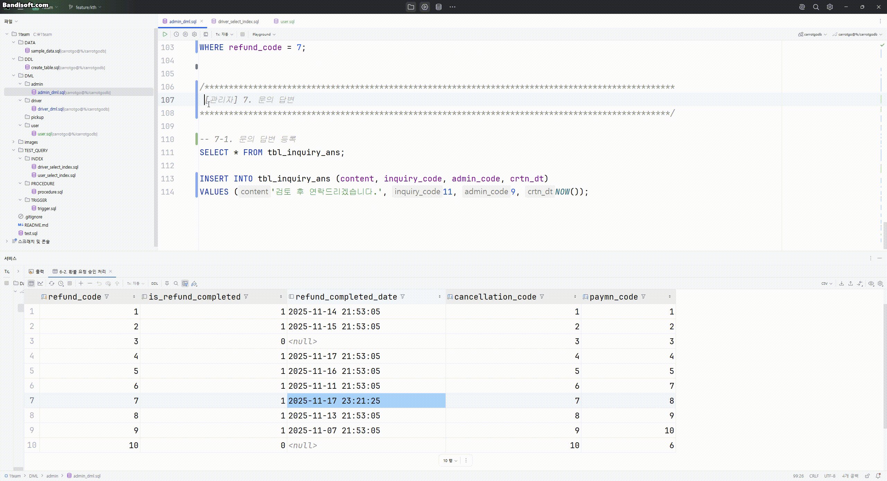</img></p>
</details>

<br>

### 5-2. 회원
<details><summary>회원가입 후 확인</summary>
  <p align="center"></img></p>
</details>
<details><summary>로그인 후 본인의 정보 조회</summary>
  <p align="center"></img></p>
</details>
<details><summary>이름과 이메일 또는 휴대폰 인증을 통해 아이디를 조회 </summary>
  <p align="center"></img></p>
</details>
<details><summary>비밀번호 찾기 후 재설정</summary>
  <p align="center"></img></p>
</details>
<details><summary>신고 작성</summary>
  <p align="center"></img></p>
</details>
<details><summary>마이페이지 수정</summary>
  <p align="center"></img></p>
</details>
<details><summary>회원 탈퇴</summary>
  <p align="center"></img></p>
</details>
<details><summary>문의 작성</summary>
  <p align="center"></img></p>
</details>
<details><summary>리뷰 작성</summary>
  <p align="center"></img></p>
</details>
<details><summary>리뷰 조회</summary>
  <p align="center">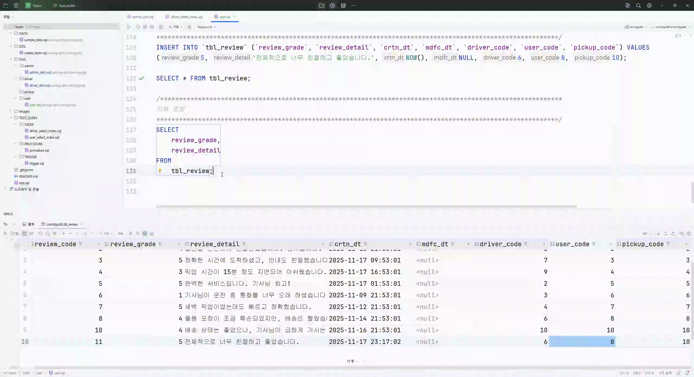</img></p>
</details>
<br>

### 5-3. 배달기사
<details><summary>전용코드로 로그인 할때 해당 기사의 정보 조회</summary>
  <p align="center"></img></p>
</details>
<details><summary>기사의 근무 내역 조회(상태: 완료 / 예정 / 취소)</summary>
  <p align="center"></img></p>
</details>
<details><summary>배정된 근무일,시간,지역 조회(스케줄 + 지역)</summary>
  <p align="center"></img></p>
</details>
<details><summary>평점,리뷰,월별 완료 건수 통계 조회</summary>
  <p align="center"></img></p>
</details>
<details><summary>과거 일정, 미래 일정 조회</summary>
  <p align="center"></img></p>
</details>
<details><summary>배송 상세 정보(사용자의 이름 / 사용자의 연락처 / 픽업 / 배송지) 조회</summary>
  <p align="center"></img></p>
</details>
<br>

### 5-4. 픽업
<details><summary>"김나라씨의 아르마니 코트" 픽업 요청</summary>
  <p align="center"></img></p>
</details>
<details><summary>"김나라씨의 아르마니 코트" 픽업 요청 날짜 변경</summary>
  <p align="center">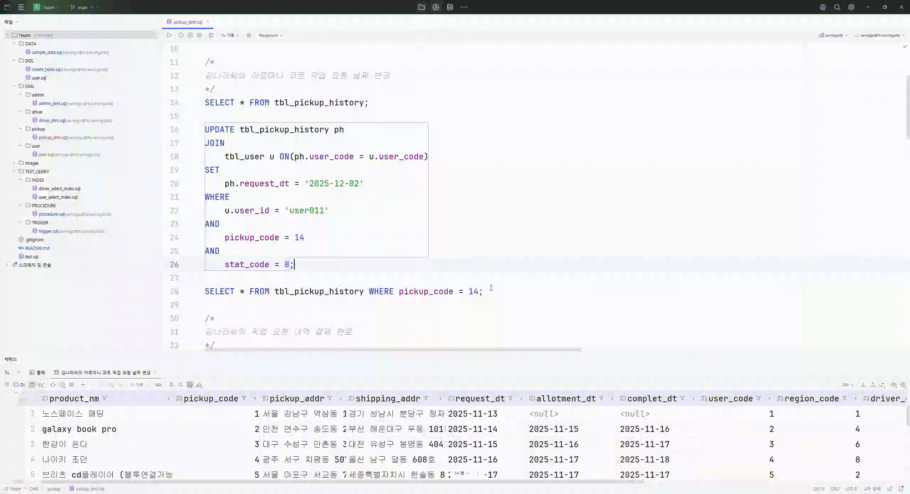</img></p>
</details>
<details><summary>"김나라씨의 아르마니 코트" 픽업 요청 내역 결제 완료</summary>
  <p align="center"></img></p>
</details>
<details><summary>"김나라씨의 아르마니 코트" 픽업 요청 취소</summary>
  <p align="center"></img></p>
</details>
<details><summary>"김나라씨의 아르마니 코트" 픽업 요청 내역 환불 신청</summary>
  <p align="center"></img></p>
</details>
<details><summary>"박나라씨"의 이전 픽업 내역 조회</summary>
  <p align="center"></img></p>
</details>

---

## 6. 성능 향상 테스트케이스
<details><summary>INDEX</summary>
  <p align="center">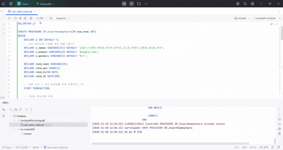</img></p>
</details>

* INDEX를 사용해 EXPLAIN을 통해 인덱스 키가 적용되었다는 것을 보여준 후 실행 속도가 향상된 것을 확인
  
<details><summary>PROCEDURE</summary>
  <p align="center">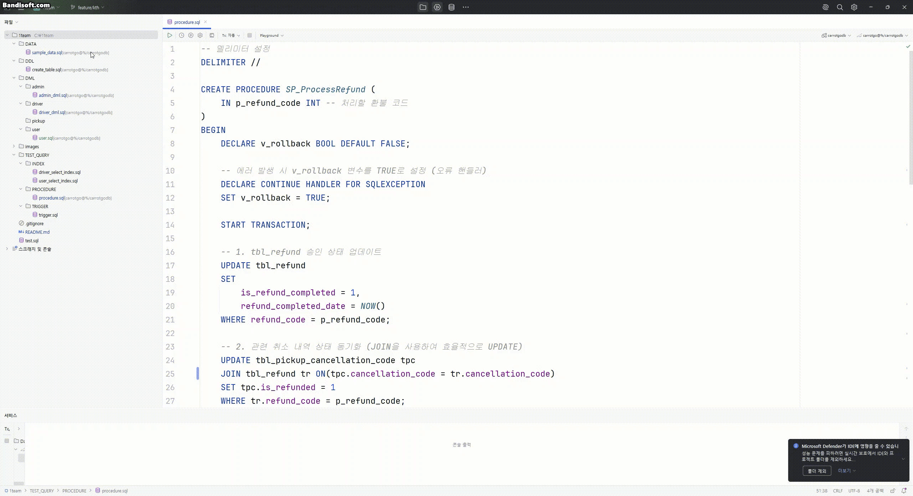</img></p>
</details>

* "환불 처리(refund_code = 8) 시, SP_ProcessRefund 프로시저를 도입하여 환불 승인(tbl_refund)과 취소 내역 동기화(tbl_pickup_cancellation_code)를 하나의 트랜잭션으로 묶어 처리했습니다.
이를 통해 데이터 불일치 가능성을 원천 차단했으며, 애플리케이션과 데이터베이스 간의 통신 횟수를 줄여 관리자 페이지의 응답 속도와 안정성을 동시에 향상 시켰습니다.

* 프로시저 도입 전에는 1. 환불 기록 상태 업데이트 2. 관련 취소 코드 조회 3. 취소 내역 상태 동기화를 통해 3회의 통신을 해야하지만 프로시저 도입 후에는 이 3단계를 DB 내부에서 처리하여 통신 횟수를 1회로 줄였습니다.

<details><summary>TRIGGER</summary>
  <p align="center"></img></p>
</details>

* trg_after_inquiry_ans_insert 트리거 도입으로, 관리자가 답변을 등록할 때 DB와 주고받는 통신횟수가 절반 줄어든다.
<br>

## 7. 레플리카 서버 구축
### 레플리케이션 (Replication) </p>
DB를 복제하는 것으로 2대 이상의 DBMS를 master와 slave(또는 다중 slave) 구조로 나누어 비동기 복제 방식으로 데이터를 저장하는 것으로 데이터 백업이 실시간으로 이루어진다.
<details><summary>master 확인</summary>
  master 서버에서의 상태 확인
  <p align="center">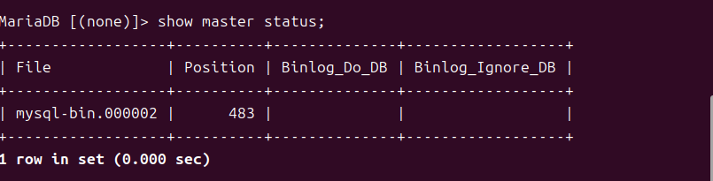</img></p>
</details>
<details><summary>slave 확인</summary>
  slave 서버에서 master와 연결되었는지 확인
  <p align="center">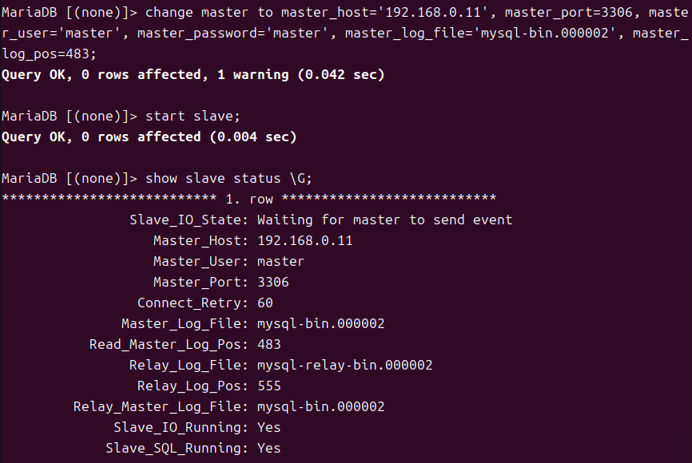</img></p>
</details>
<details><summary>master-slave 연결 확인(데이터 값 확인)</summary>
  slave 서버와 master서버가 연결되어 master서버에서 테이블을 생성하고 INSERT 했을 때 slave에서도 조회 가능하다.
  <p align="center">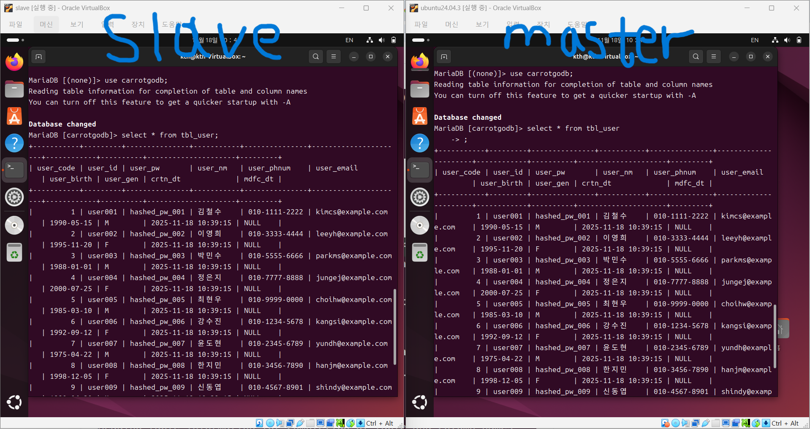</img></p>
</details>


## 8. 프로젝트 회고
<table width="100%">
  <thead>
    <tr align="center">
      <th width="20%">이름</th>
      <th>내용</th>
    </tr>
  </thead>
  <tbody>
    <tr>
      <td align="center">윤성원</td>
      <td style="padding:12px; line-height:1.7; text-align:left;">
        <p>이번 프로젝트를 진행 하면서 팀 원들과의 소통이 중요하다는 것을 다시한번 느끼게 됐고 요구사항 명세서가 정확하게 구현이 되어야 뒤의 작업들이 문제 없이 진행이 된다는 것을 뼈저리게 느꼈습니다.</p>
      </td>
    </tr>
    <tr>
      <td align="center">박지민</td>
      <td style="padding:12px; line-height:1.7; text-align:left;">
        <p>팀원들과 SQL,리눅스 기반 프로젝트를 하며 협업의 중요성과 명확한 역할 분담의 필요성을 깨닫고, 문제를 함께 해결하며 실무 이해도와 기술 활용 능력이 크게 향상되었다.</p>
      </td>
    </tr>
    <tr>
      <td align="center">황자현</td>
      <td style="padding:12px; line-height:1.7; text-align:left;">
        <p>이번 DB 프로젝트를 통해 요구사항 분석부터 ERD 설계, 모델링, 프로시저 구현까지 전체 과정을 경험할 수 있었습니다. 요구사항 명세서와 ERD 작성에서 어려움이 있었지만, 테스트 과정에서 누락된 요구를 발견하고 팀원들과 논의하며 설계를 보완할 수 있었습니다. 설계 과정이 가장 중요하다는 강사님의 말씀을 직접 체감할 수 있었습니다.</p>
      </td>
    </tr>
    <tr>
      <td align="center">김태형</td>
      <td style="padding:12px; line-height:1.7; text-align:left;">
        <p>이번 프로젝트에서 유스케이스, 요구사항 명세서, ERD까지 설계 단계를 직접 진행하며 설계의 중요성과 복잡성을 깊이 체감했습니다.

초기에는 설계에 필요한 시간 배분에 어려움을 겪고, 기능을 너무 복잡하게 생각한 부분도 있었습니다.

하지만, 팀원들과 충분한 대화를 나누며 어려움을 함께 해결해 나가는 과정에서 큰 보람을 느꼈습니다. 협업의 중요성을 깨닫게 된 소중한 경험이었습니다.
      </td>
    </tr>
    <tr>
    </tr>
  </tbody>
</table>

